title: 《硬派健身》笔记
author: zansy
tags: 

  - Lifted
categories:
  - 读书摘录
date: 2019-06-12 19:21:16
---
健身书笔记
<!--more-->

# 基础正确观念

- 一开始健身的时候最应该练修饰效果好的大肌群：胸背臀腿。
- 入门：每天做一次大肌群训练（胸、背、臀、腿）6～10组，搭配核心肌群训练（腹部、下背部）1～3组，最后做HIIT（高强度间歇训练）15到30分钟。不到半年，你就会惊喜地看到自己的改变。

# 减肥失败的原因

## 节食失败

### 节食变蠢

- 节食真的会“吃掉”你的脑子。根据美国爱因斯坦医学院的研究，让老鼠节食后，其下丘脑的神经元开始吞噬它的细胞器和蛋白质。下丘脑区域主要是负责管理睡眠、温度、口渴和饥饿等生理机制的（所以我们常会因为太饿而睡不着觉，因为口渴而错以为自己饿了）。当下丘脑开始吞噬自己的细胞器和蛋白质时，我们会越发感觉饥饿。这也可以理解为大脑的自我保护反应。
- 通过节食来减少热量的摄入，不仅不可能达到你幻想中的“日常热量收入＜日常热量支出=减肥”这个简单的公式，你的身体还会用克扣智商、降低免疫力等行为，让你的热量支出越来越低。身体为了能够让你活下去，把公式调整为“日常热量收入≈日常热量支出—智商—健康”，从而减肥失败。

### 节食反弹

**体重的设定点（setpoint）理论**：当你的体重被身体确切地设定在一个点上后，它会尽可能以一种只进不出、只加不减的方式来维持甚至是增加体重。在你的体质、生活习惯没有全面改变的情况下，单单通过控制饮食、减少热量摄入是不可能真正减去体重的！

### 节食导致暴食

- 克制进食导致的神经性贪食、暴食是很难避免的。
  - 其一，克制进食者在节食后，对高热量、高糖、高脂肪食物的喜爱程度显著增加，这可能与胰岛素等激素的分泌水平有关。
  - 其二，血糖不规律的变化会导致节食者血清素系统的剧烈变动，其中包括5羟色胺2A受体等一系列功能的减弱。而血清素系统主要负责人体食欲的调节。

## 运动失败

- 虽然在运动中，低强度有氧运动所消耗的脂肪量明显高于高强度间歇训练，但是在运动结束后的一段时间里，相对于低强度有氧运动，高强度间歇训练的减脂作用一直在持续，最终在24小时内，所消耗的脂肪总量居然超过了低强度有氧训练。而更令人感到神奇的是，高强度间歇运动所造成的持续燃烧脂肪、消耗热量的时间竟能持续72个小时左右。
- 高强度间歇训练、无氧训练，相对于长时间的低强度有氧运动，更能提高机体的新陈代谢水平，提升一段时间内身体消耗热量、消耗脂肪的能力，从长远来看，减脂减肥的效果更好。<u>（力量训练增加的肌肉更是能耗大户，有数据表明：在静止的情况下，一磅肌肉24小时内能消耗6千卡的热量，而一磅脂肪在相同的环境下只能消耗2千卡的热量。）</u>
- 有氧运动就相当于小时工：工作时间长，短期内比较高效，但没什么升值空间。高强度间歇训练和无氧训练则像是初级白领，虽然一开始看似收获不大，但你的工作性质决定了你的幸福感更高。
- <u>单纯的长时间有氧运动可以提升一些健康指标，比如血压什么的，但是在长时间的尺度上并无益于体重和身体脂肪的减少。</u>体脂含量有点儿像央行的存款准备金率，准备金率不会被实际的收入和支出影响，能影响准备金率的是央行对整个国家和世界市场的评估。体脂含量也一样。你的实际热量收入和支出，是不会影响到体脂含量的。能决定体脂含量的，是身体对你整个人体质的评估。
- 支出脂肪实际上不会真的导致体脂降低。只要你还在正常地生存、吃喝，人体就会让你把脂肪好好补充回来，以备以后有需要时使用。
- 在不改变身体基础素质的情况下，单纯的热量支出后，身体会迫使你摄入、吸收更多的热量，偿还你这次有氧运动消耗的脂肪。人体作为一个调节系统，不会因为你进行了有氧运动，消耗了脂肪，就整体下调你的体脂储备。想要高效减脂减重，你需要更多、更综合的健身内容。
- 跑步等运动会在脂肪和关节等部分引起共振，共振的效应最后会引起身体与关节的损伤。目前的研究发现，脂肪的体积越大，重量越重，共振的效果越强，对身体的伤害也就越强。
- 在跑步的时候，<u>起跑对关节的冲击能达到自重的2～8倍。22如果膝关节在润滑不足的情况下互相摩擦，很容易导致软组织、关节等部位出现问题</u>。即使是健康的跑步者，很多人在不重视力量训练的情况下，也很容易出现跑步膝（髂胫束摩擦综合症）的症状。

# 最减脂的有氧运动：HIIT

> HIIT就是一种高强度运动与低强度运动间歇交替的训练方式，只要运动中的强度是高低交替的，都可以视作广义上的HIIT。比如你快跑一会儿，慢跑一会儿，或者骑车冲刺与慢行交替，都是HIIT训练。

- HIIT的特点在于：短时间内运动强度较大，每次都要达到最大或至少接近最大的运动能力。但是，运动时间相对较短，并且可以通过间歇期间的低强度，来避免不适症状的出现。
- HIIT，即高强度间歇训练，就已经包含了两个重点：一个是高强度，一个是间歇。什么样的强度才算高强度呢？拿跑步举例，高强度是指你在百米冲刺比赛时，咬着牙，拼尽全身力气冲刺的强度，一般认为是采用全力冲刺或90%左右最大摄氧量的强度。而间歇，就是指在两次高强度运动之间用来喘口气的时间。

## HIIT如何作用

### 变化的高强度

- 持久减脂，刺激生长激素分泌

> 学界一般认为生长激素与乳酸阈高低有关系24，如果运动强度一直比较低，相应的血乳酸水平也会比较低。而高强度运动是可以刺激乳酸分泌的，乳酸水平的提高，则可以刺激生长激素的分泌。
>
> 慢跑等长时间有氧运动，由于强度比较低，不会引起乳酸水平的提高，也就是说，不会让生长激素大量分泌。
>
> 简单来说，生长激素就是运动越激烈的时候，分泌得越多。所以，越高的训练强度，越能刺激生长激素的释放。
>
> 另外，高低强度交替，也能促进肾上腺素分泌提高。肾上腺素也可以提升脂肪的消耗与总热量支出。
>
> 总结上面两点可以得出，对比普通的有氧运动，比如强度较低的慢跑之类，**变换的高强度间歇训练不仅可以刺激增肌减脂的生长激素的分泌，而且可以让运动的减脂效果更持久。**

### 间歇运动

- 强效减脂，促进脂肪代谢

> 在有间歇的训练中，肾上腺系统的反应相对于无间歇训练更大，分泌的肾上腺素等也更多。而肾上腺系统分泌的激素主要起着比较强的刺激机体分解脂肪、让脂肪燃烧、为身体运动供能的作用。所以，间歇性的运动，反而能让机体更好地燃烧脂肪。

### HIIT：更好的有氧运动

- 长时间有氧运动在消耗脂肪的同时也在消耗肌肉，而肌肉作为人体的热量消耗大户，直接影响人体的新陈代谢效率，所以，消耗肌肉也就意味着你的新陈代谢随之降低。

> 举个简单的例子，假设你在减肥前，每天三碗米饭，体重不增不减，就是说你的新陈代谢能很好地利用完这三碗米饭。现在你通过长时间有氧运动把自己的代谢能力降低了，你还是选择吃三碗米饭，但你的身体只能消耗两碗多了，那剩下的小半碗怎么办呢？身体自然会选择将其转化为脂肪存起来。所以，如果你通过长时间有氧运动的方式来减重减肥，即使你每天累得半死，如果不相应地控制并减少日常生活中的热量摄入，你体内的脂肪还是会越囤越多。

- EPOC（运动后超量氧耗）：EPOC就是高强度运动后，身体仍然持续的超强的燃脂状态。

> 比如，健身房中，你正在做一个100公斤的深蹲。为了把杠铃举起来，你必须使用爆发力，而身体在这种状态下处于无氧运动状态，也就是我们上面提过的脂肪不能参与供能系统的状态，此时，你只能利用身体里的糖原实现供能。但问题是，身体是不喜欢你用它的糖进行运动的。身体总想着：“糖这玩意儿这么好用，我还想储备着，以防不时之需呢！”你只能苦苦哀求：“求你了，我都快被100公斤的杠铃压死了，你借我点儿糖，让我把这杠铃举起来，以后我多还你点儿！”
>
> 从理论上讲，人体在运动中欠的部分叫作“**氧亏**”，即单靠有氧运动不能满足供能的部分。在这一部分，你欠下了债，而运动之后，你要把这些糖和氧，以消耗脂肪的形式，还给身体，这就是EPOC，运动后过量氧耗。这也就是为什么高强度运动不进行有氧呼吸，不能消耗脂肪，仍然减脂能力超群的原因。

- EPOC的发现，给了运动者一个新的启示：从这一刻开始，增肌和减脂并行不悖了。一方面，我们可以通过力量训练，比如深蹲、卧推、高位下拉，达到提升体能、完美塑形的目的。另一方面，通过这种抗阻训练后的EPOC，明显提高人体的能耗和脂肪燃烧，让人们一边增肌，一边减脂。那么，什么因素可以增加EPOC呢？答案是：关键在于高强度、短间歇、多间歇。

## 怎么做HIIT效果最好

- HIIT运动实际上就是间歇性地提高与降低运动强度，所以，只要满足“间歇性”和“高强度”两个条件，某种程度上自己就可以排列组合了。你只需要确保是大肌群训练（臀、腿主要发力）、高低强度交替，那么持续15到20分钟，就能够达到HIIT健身的目的。
- 高低强度交替的规律，我建议变化间隔要短，不要5分钟高强度、5分钟低强度，因为高强度时间太长，无法保证强度忠实完成，最后还是成为中等或低强度的训练。而变化的间隔越短，对于脂肪的供能比提升越多。

## 简易HIIT训练计划

### 体重向下、楼层向上的高效减脂运动——爬楼梯

- 在爬楼梯的过程中，运动到的股四头肌和臀大肌都是大肌群，就像我之前说的，大肌群燃脂能力极高，对身材的塑造效果也最好。
- 爬楼梯的<u>翘臀</u>效果格外好，掌握了爬楼梯的技巧之后，你可以很轻易地训练到臀部，无时无刻不在健身。
- 做这个HIIT的时候，<u>只上楼梯不下楼梯</u>

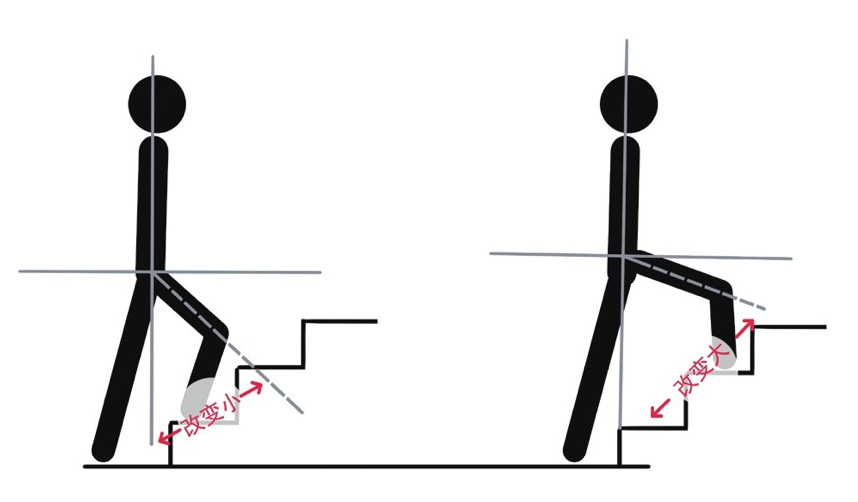

>爬楼梯时，一次上两个台阶，臀部更容易翘起来。训练臀部，最重要的是改变大腿和上半身之间的髋角，髋角改变越大，对臀部的刺激越大。一次上两个台阶的时候，髋角比一次上一个台阶时更大，训练效果当然也更好啦！但要注意，无论是上两个台阶还是上一个台阶，背部都要挺直，不可以弯曲。提脚的时候，膝盖不能超过脚尖，同时在心中默念：**用臀部发力**。

爬楼梯的HIIT具体操作：高强度、间歇。

现在把高强度定为“一次性上两个台阶，以快速冲刺的速度向上爬”，在此基础上再增加两个强度，一个是“以较快的速度向上爬”，另一个是“以一般的速度向上爬”。

这三种速度，最快的速度更侧重臀部的塑形，一般速度侧重心肺功能的培养，而很慢的爬楼梯速度则相当于HIIT中的间歇休息，有助于身体承受之后快速爬楼梯带来的压力。因此这三种速度结合不仅对翘臀的训练效果很好，对体能增加也有不小的成效。

按照这三种速度交替着往上爬，比如一层楼速度很快，第二层楼速度中等，第三层速度相对较慢。之后也可以一楼快速、一楼较慢、一楼速度中等，继而再一楼速度很慢或速度很快之类。以此类推，只要两种速度不重复就行。

一般而言，住10楼爬10次，住5楼爬20次。一周3次，每次半个小时。

####  半蹲侧向行走

如果找不到臀部发力的感觉，那么就先做一组臀部激活动作吧。

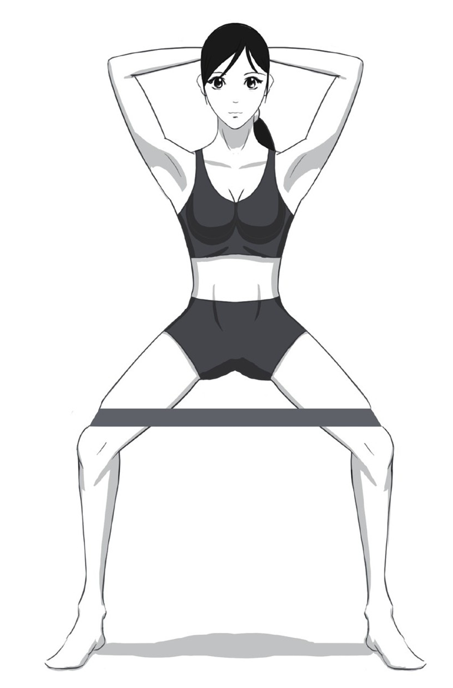

1. 在膝关节或踝关节处使用弹力带或弹力圈，半蹲下来。
2. 左右侧向行走。
3. 左右各10步为一组，做2～3组就可以。

### HIIT针对室内的懒人操

#### 第一套 翘臀大法：侧弓步+沙发深蹲跳+臀桥

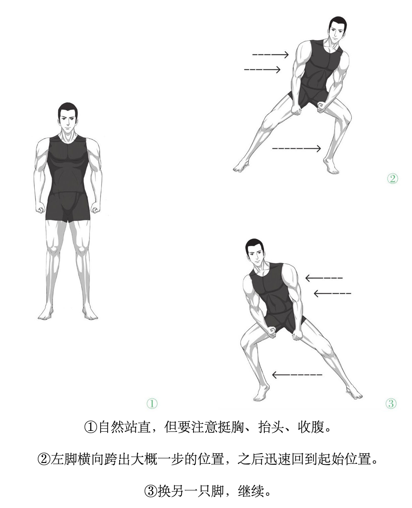

- 侧弓步其实是一个激活动作，能很快地让身体适应“动”的节奏
- 这个动作持续一分钟，之后休息10秒。一开始不用追求速度，如果你在做该动作的过程中感觉不适，可以慢一些，然后循序渐进地加快。

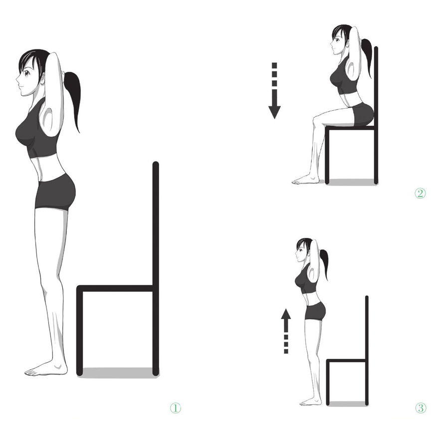

1. 从站立姿势慢慢坐在沙发上，双手置于脑后。
2. 背部挺直微反弓（重要），把臀部往沙发深处挪移！就是往深处坐，坐得非常靠里。
3. 臀部发力至后脚跟！用爆发力让自己跳起来！落地时要柔和，用肌肉做缓冲。

- 持续一分钟，休息10秒。
- 为什么要往沙发深处坐一下：这就是让你调整自己的重心，使其更靠后，让臀大肌处于更能发力的状态。在沙发上，你可以不依靠股二头肌的力量就能轻松地调节身体平衡，让自己做出一个标准的深蹲。 

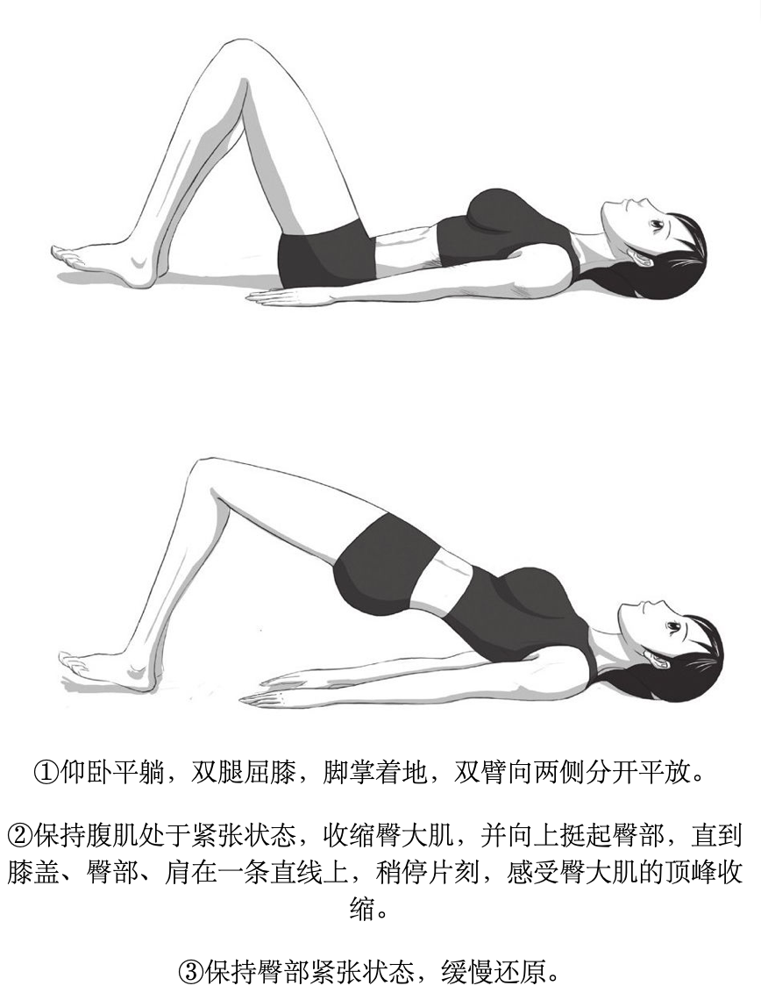

- 持续一分钟，休息30秒。 
- 这个动作加上前面两个动作为一组，每次做4组，加上休息的时间也不过15分钟，却能让你很快地燃脂并翘臀。

#### 第二套 超速减脂大法：跳跃拍手+直膝前踢+俯卧登山

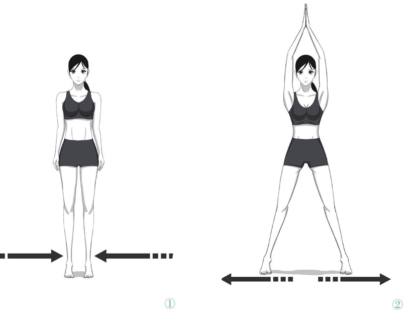

1. 脚自然并拢站立，双手垂在大腿两侧，准备。
2. 跳起的时候同时打开双手双脚，双脚宽距着地的同时双手拍掌；跳下一次的时候恢复起始动作。

- 持续做一分钟，接着休息10秒

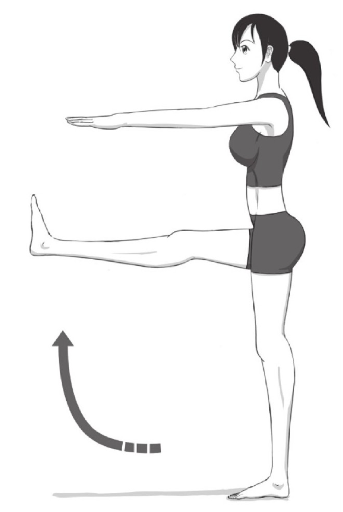

1. 自然站直做准备。
2. 一只脚直直向前踢的同时，伸出反方向的手去碰脚尖，比如左手碰右脚，或右手碰左脚。
3. 轮流替换。

- 持续做一分钟，接着休息10秒

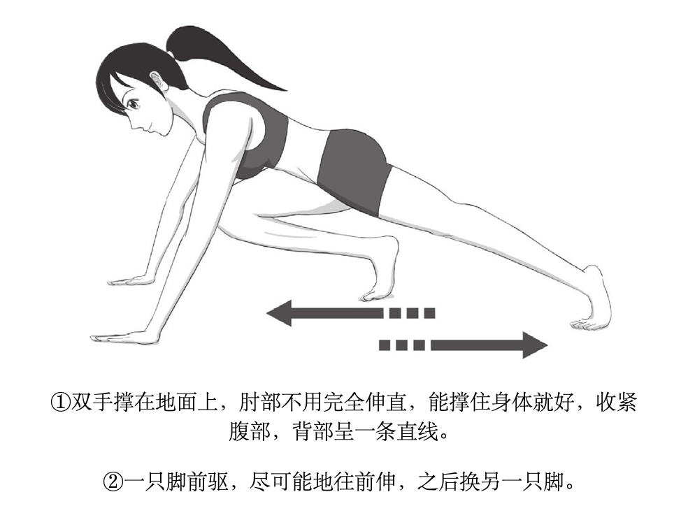

- 撑在地面上的时候，绷紧腹部，这就动用到了你的<u>核心肌群</u>，也就是腰腹部所有大大小小的肌肉。*一般你的核心肌群不够强大的时候，做出“撑”这个动作，就需要借助你背部、臂部甚至胸部的肌肉一起参与进来*。所以，看似只有下肢在动的一个动作，实际上用到了身体中几乎所有的肌肉。而且，下肢又是耗能大户，所以要不了多久，你就会累得发软——没关系，请坚持一下，在一开始这些都是正常的。
- 持续做一分钟，接着休息10秒
- 这个动作加上上面两个动作为一组，照例，每个动作一分钟，休息10秒，每次4组，每周3次。

#### 第三套 胸大腰细大法：俯卧撑+俯卧撑跳+平板支撑

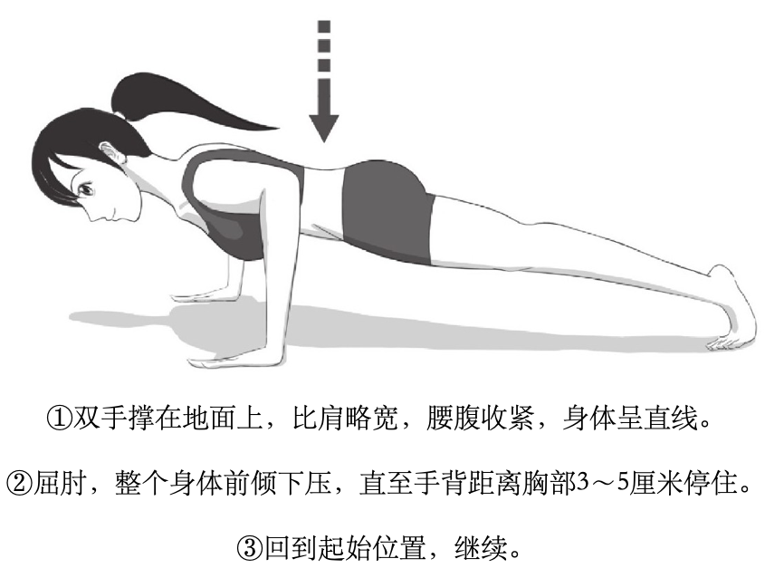

- 如果做不了俯卧撑，那么可以跪在地上做跪式俯卧撑。除了“跪”这个区别之外，其他的动作要领与标准俯卧撑几乎毫无区别。

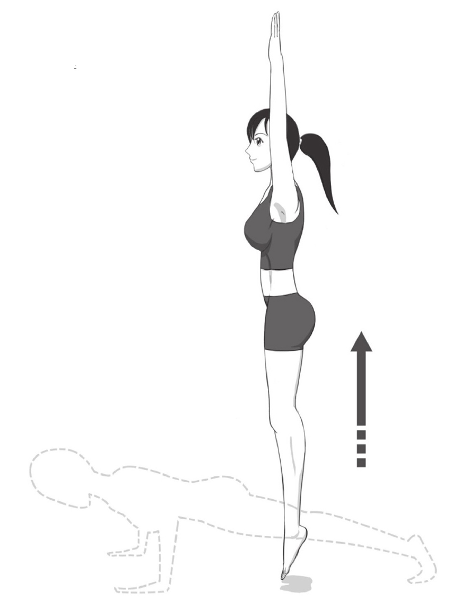

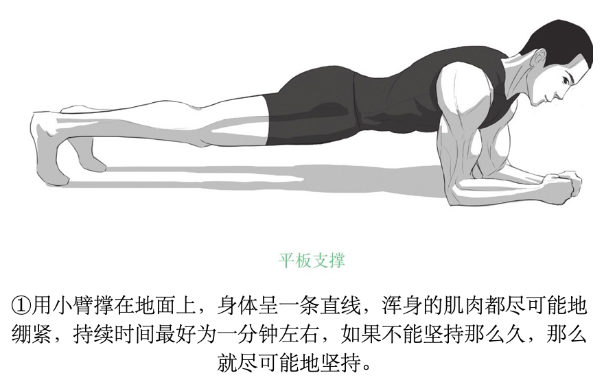

- 一分钟之后，这一组的动作就结束了！还是3个动作为一组，只是这一组的区别是：到第二次的时候，将俯卧撑替换成<u>下斜俯卧撑</u>，这样可以刺激到你胸肌的上半部分。而到第三次的时候，换成<u>上斜俯卧撑</u>，修饰胸部下面的弧线，让胸部全面而均匀地发展。

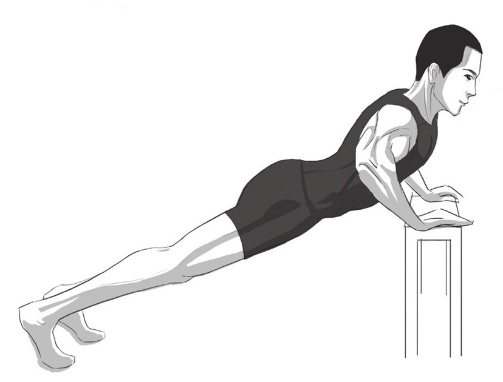

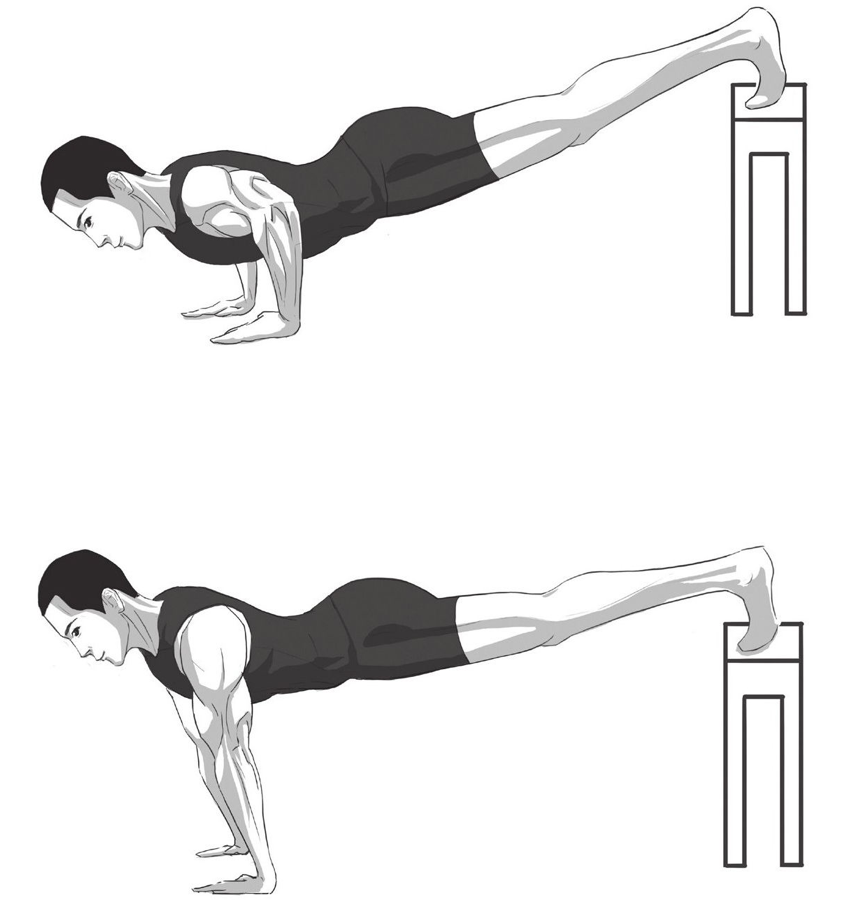

- 上斜、下斜的动作也很简单，找一个20～40厘米高度的器材，上斜时双手垫在上面，下斜时则是双脚放在上面。一开始可能有些难，实在不会，用跪式俯卧撑就好了。
- 除了俯卧撑之外，其他的动作不变，第一个动作是俯卧撑、上斜俯卧撑、下斜俯卧撑；第二个动作在原有动作的基础上增加跳跃；最后以平板支撑压轴。一次4组，每周3次。

#### 第四套 美好身姿大法：十字挺身+俯卧撑跳+平板支撑

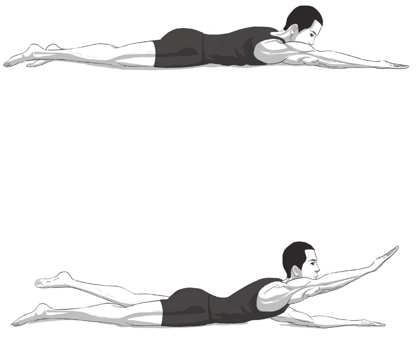

1. 俯卧趴在地上，两手向前伸直。
2. 左腿和右臂同时向上抬起，直到感觉下背部收缩拉紧
3. 保持上面的姿势不动，数1、2、3，静待3秒。
4. 放下左腿和右臂，换右腿和左臂做相同的姿势，静待3秒。

- 这个动作侧重腰椎的保护，如果你常年伏案工作，那么腰椎一定不太好，而十字挺身能纠正你的腰椎，让你无论是站立还是静坐的时候都能保持一个更健康的姿势。
- 一分钟，之后休息10秒。

2.俯卧撑跳+平板支撑

#### 第五套 全面与细节：直膝前踢+哑铃深蹲推举+卷腹

1.直膝前踢

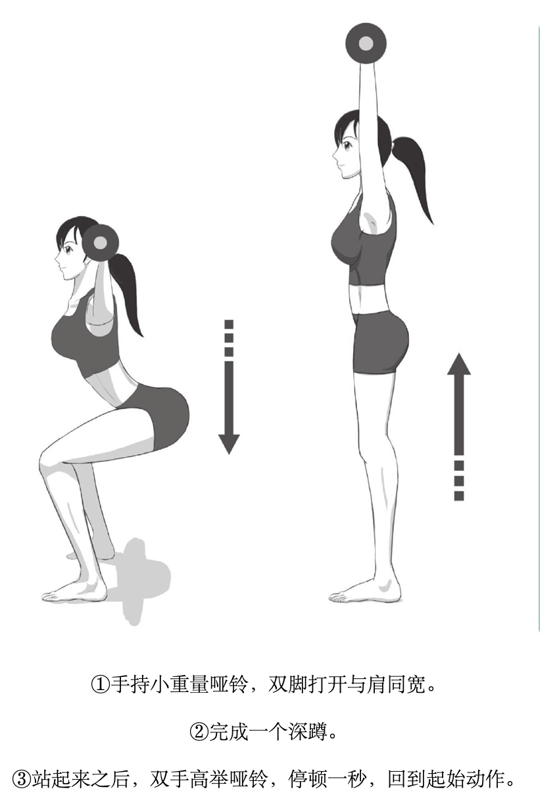

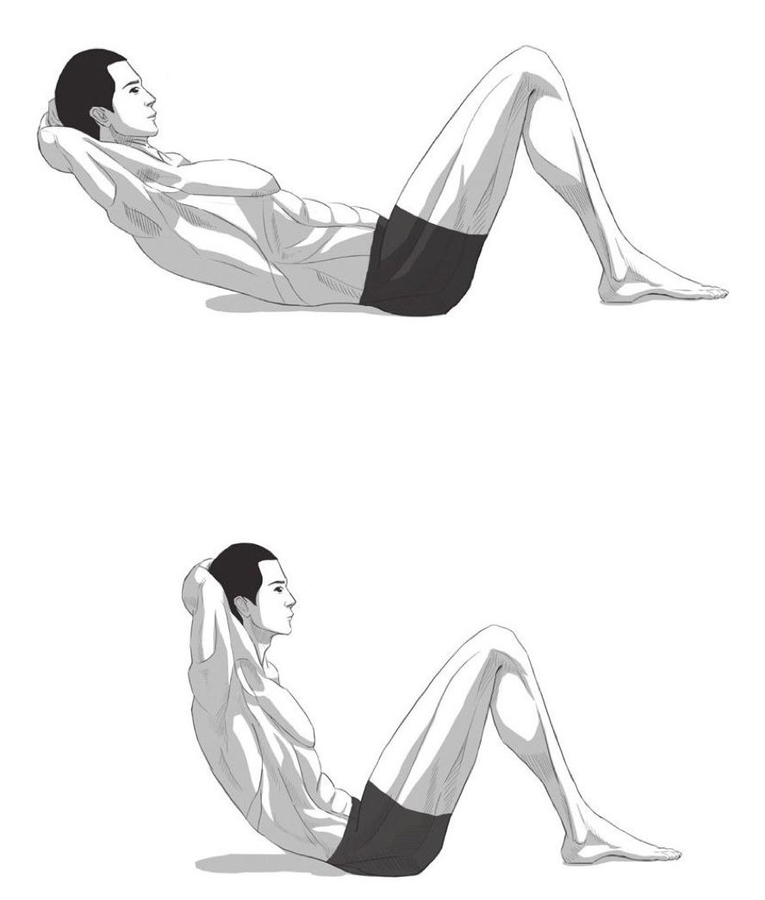

1. 平躺在地板或瑜伽垫上，自然弯曲双腿，双手放在脑袋后面。注意只是放在那里，并不用力。
2. 发动腹肌的力量使身体蜷曲，要感受到腹部的发力，让腰部皮肤形成褶皱，坚持一秒，回到起始位置。 

- 直膝前踢是塑造更好的大腿线条，哑铃深蹲推举同时照顾到臀部和肩部，卷腹则着重训练腹部。肩膀要负责撑起衣服，而腰部则是各种比例的轴心，纵向能分隔上肢与腿，横向能加大胸、腰、臀三点之间的曲线。

# 塑形的抗阻训练

## 胸大显腰细

- 胸肌最大的作用是使大臂肱骨水平内收，这在日常生活中的表现就是推东西。真正作用，很大一部分是攀爬和投掷。胸肌的上下沿结构只有在举手过顶的时候才起到作用。
- **上胸很大一部分是连接锁骨的，另一部分则是连接着大臂**，所以，上胸的动作应该更加侧重于改变胸锁关节和肩锁关节。那么，练习胸肌最重要的一个要点就是——大臂移动，向内夹，活动肩关节，水平内收。
- 徒手胸肌训练：俯卧撑。俯卧撑除了能使胸大肌、三角肌前束、肱三头肌得到非常有效的训练，对于核心肌群也有很好的训练效果。

### 标准的俯卧撑如何做

- 真正的俯卧撑是用胸肌发力，将自身推起并有控制地落下，相当于一个负重训练，而重量就是你本人的体重。

### 俯卧撑的几个要点

1. 首先，身体要挺直，无论上升还是下降，躯干都应该是一条直线，即腹肌、背肌、臀肌绷紧，这样可以更好地传达力量，并训练到核心肌群。有人做俯卧撑时，手肘会有弹响，一般来讲不是大问题，那是手肘处的筋滑过骨头的声音，可以调整肘部的朝向试试。
2. 其次，在做动作的过程中，注意发力的方式是夹紧胸部，用胸部发力，而不是伸直肘部，这样能更好地训练到胸。“胸部发力”这个词听起来可能太抽象，简单一点儿的办法是：在动作过程中试着逐渐减轻胳膊的负担，把手臂当作支架，只配合，不用力。一开始可能觉得有些难度，但随着训练的次数越来越多、胸肌越来越发达，你会觉得手臂的重要性越来越小，这个时候，你就算是真正地锻炼到胸部了。如果条件允许的话，建议一开始练俯卧撑的时候对照着镜子练习，看自己的身体是不是一条直线。无论如何要保持身体绷成一条直线——这是做很多动作都需要注意的一点，越早养成这个习惯，健身就越简单，请牢牢记住这一点。
3. 最后，除了上升阶段要发力，下落阶段也要缓缓发力下降——为了加强肩部关节的稳定性，防止受伤。

### 宽距俯卧撑和窄距俯卧撑有什么不同？

- 根据双手打开距离的不同，俯卧撑可以分为宽距俯卧撑和窄距俯卧撑。

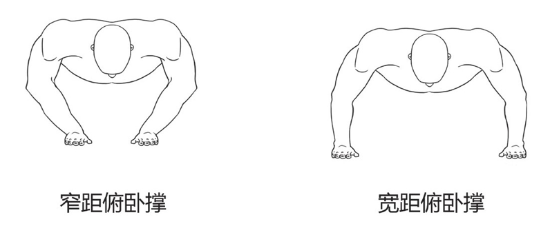

- 宽距俯卧撑能更好地训练胸肌。
  1. 双手距离更宽，上臂外展，内旋的作用增加，让胸大肌可以更好地发力。
  2. 宽距增加了胸肌一开始的长度，使之一开始就被拉伸，也就相应地增加了它的收缩力。
  3. 握距加宽，重力做功也大了，而负荷越大的时候，胸肌发力也越多（胸肌是主动肌和运动核心关节肌）。

- 窄距俯卧撑则可以更好地训练肱三头肌。
- 在做俯卧撑的过程中，越是找不到胸部发力感觉的人，越要多做俯卧撑啦。

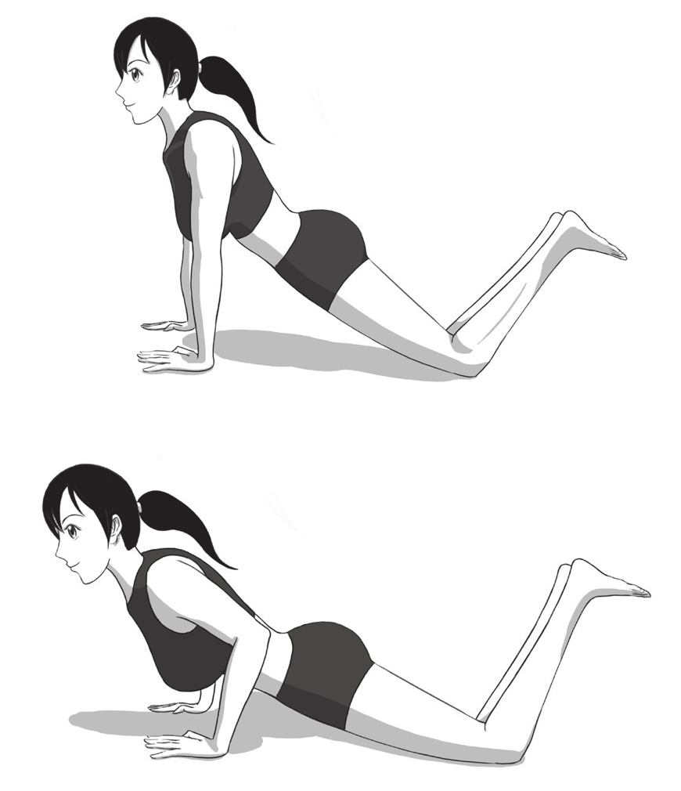

- 在确保上肢绷紧，保持直线的状态下，你如果想要俯身，无论如何都要借助上肢肌肉。上斜俯卧撑则是侧重改变肩关节的发力角度，但最终效果还是一样减轻了撑起的重量，让动作变得更为容易、简单，有一个循序渐进的过程。
- 如果你的目的是塑身、丰胸、增肌，俯卧撑每组8～20个，每天3～6组就可以了。

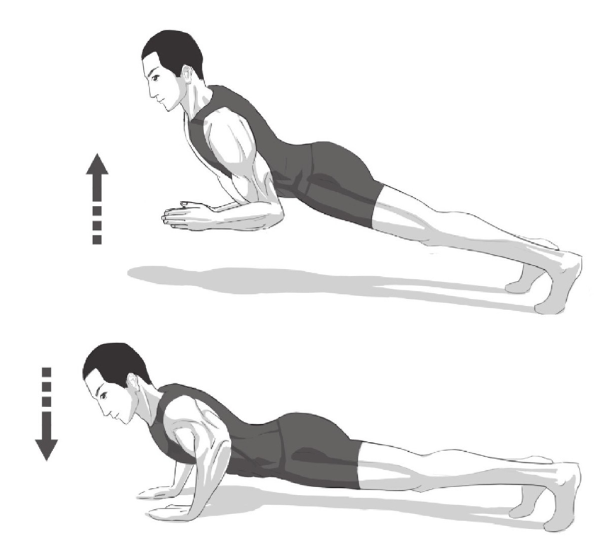

- 虽然名字叫击掌俯卧撑，但是不击掌也完全没问题。动作与传统俯卧撑完全一样，只是**在发力阶段尽量把自己推起就可以了**。它不仅像俯卧撑一样，无器械，随时随地方便训练，针对胸肌等大肌群，而且可以更高效地增加力量、耐力，强化整体塑形。
- 传统俯卧撑推起时，肌肉在做等张收缩，下落时，肌肉在做离心收缩。而击掌俯卧撑推起时，肌肉在做等动收缩，下落时，肌肉在做超等长收缩。
  - 等动收缩就是指在整个运动过程中，所有肌肉都发挥了自己的最大力量。
  - 超等长收缩，是指肌肉在缓冲制动的阶段，肌纤维被拉长，然后立即快速有力地进行收缩的一种方式。目前学术界认为它是最佳的**训练爆发力**的方式。
- 击掌俯卧撑虽然是比较安全的动作，但是，下落时也会受到一定的冲击。所以，练习的过程中一定要循序渐进，一开始千万不要用关节和骨骼强吃下落的力量，这样不仅不能很好地训练肌肉，而且会对关节产生不好的损耗。我们的目标是掌握由胸部肌肉、三角肌来吸收冲击的方法，是每次都能感觉像弹跳一样用胸肌弹起来身体。
- 重心应在掌根，别小看重心的转移，它可以改变胸锁关节的发力角度，让你的胸肌更好地发力，从而让你更好地训练到胸。
- 训练上胸最好采用**下斜窄距俯卧撑**，训练下胸最好采用**上斜宽距俯卧撑**。

#### 俯卧撑训练计划

- 热身：标准俯卧撑10个×3组。

- 正式：

  - 击掌俯卧撑每组力竭×3组。
  - 击掌上下斜俯卧撑15个×4组（上下斜各2组）。

  注：若不能做击掌俯卧撑，可以做标准俯卧撑，也可以尝试下斜击掌俯卧撑或上斜击掌俯卧撑。这两样比较容易。

- 拉伸：手抵住墙，缓缓转体，让胸部被拉伸。

### 胸肌的器械训练

- 对于胸肌训练，还是推荐在健身房中进行。胸肌需要负重比较大的动作，小负重不足以刺激它的生长。同时，胸肌的感觉很难找对，你需要专项的训练器械来帮助你。

- 而对于胸肌的形状塑造，最重要的动作有三个：**杠铃卧推、龙门架拉索夹胸和悍马机**。其中，杠铃卧推又是所有胸部训练的基础。 

#### 杠铃卧推

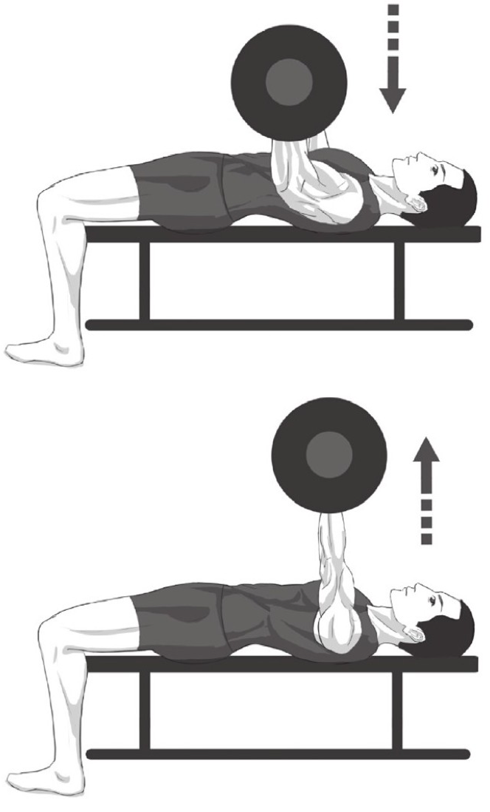

- 卧推是一个多关节复合动作，几乎可以训练到上半身所有的肌群，尤其是大家最关心的胸部。

##### 标准的平板杠铃卧推

- 动作：
  1. 仰卧在卧推凳上，双脚自然踏地，双手正握杠铃，与肩同宽或稍宽于肩。
  2. 将杠铃从卧推架上取下，缓慢下放杠铃，在杠铃离胸口有一点儿距离时停止。
  3. 迅速发力上推至手臂接近伸直，稍停后，做下一组动作。

- 要点：
  1. 发力时，注意让胸部、肩关节和大臂向里夹，而不要注意肘关节的伸直。要挺胸、沉肩。
  2. 动作过程中，上背部和臀部不可以离开凳面，形成拱腰。如果你的目标是训练胸肌，你最好也不要使用太多的腿部力量，双脚稳固而不借力。
  3. 在训练中，杠铃的位置应该处于手掌根，而非掌心或掌前部。

- 俯卧撑的重心下移是为了更好地刺激胸部，而卧推的手掌重心下移则是不让你的手腕承受太多的压力，以免损伤你的腕骨。

