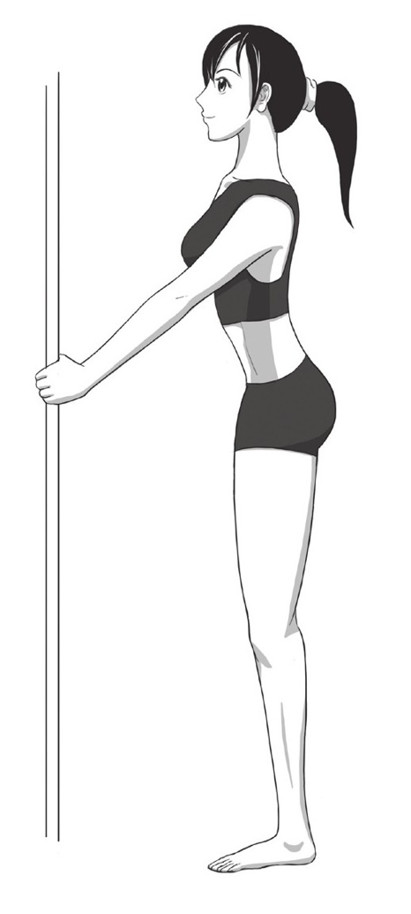

title: 《硬派健身》笔记
author: zansy
tags: 

  - Lifted
categories:
  - 读书摘录
date: 2019-06-12 19:21:16
---
健身书笔记，主要记录健身正确概念，提供部分无氧运动的完整训练计划，包括小肌群的局部训练，以及健身时的饮食注意等事项。
<!--more-->

# 基础正确观念

- 一开始健身的时候最应该练修饰效果好的大肌群：胸背臀腿。
- 入门：每天做一次大肌群训练（胸、背、臀、腿）6～10组，搭配核心肌群训练（腹部、下背部）1～3组，最后做HIIT（高强度间歇训练）15到30分钟。不到半年，你就会惊喜地看到自己的改变。

# 减肥失败的原因

## 节食失败

### 节食变蠢

- 节食真的会“吃掉”你的脑子。根据美国爱因斯坦医学院的研究，让老鼠节食后，其下丘脑的神经元开始吞噬它的细胞器和蛋白质。下丘脑区域主要是负责管理睡眠、温度、口渴和饥饿等生理机制的（所以我们常会因为太饿而睡不着觉，因为口渴而错以为自己饿了）。当下丘脑开始吞噬自己的细胞器和蛋白质时，我们会越发感觉饥饿。这也可以理解为大脑的自我保护反应。
- 通过节食来减少热量的摄入，不仅不可能达到你幻想中的“日常热量收入＜日常热量支出=减肥”这个简单的公式，你的身体还会用克扣智商、降低免疫力等行为，让你的热量支出越来越低。身体为了能够让你活下去，把公式调整为“日常热量收入≈日常热量支出—智商—健康”，从而减肥失败。

### 节食反弹

**体重的设定点（setpoint）理论**：当你的体重被身体确切地设定在一个点上后，它会尽可能以一种只进不出、只加不减的方式来维持甚至是增加体重。在你的体质、生活习惯没有全面改变的情况下，单单通过控制饮食、减少热量摄入是不可能真正减去体重的！

### 节食导致暴食

- 克制进食导致的神经性贪食、暴食是很难避免的。
  - 其一，克制进食者在节食后，对高热量、高糖、高脂肪食物的喜爱程度显著增加，这可能与胰岛素等激素的分泌水平有关。
  - 其二，血糖不规律的变化会导致节食者血清素系统的剧烈变动，其中包括5羟色胺2A受体等一系列功能的减弱。而血清素系统主要负责人体食欲的调节。

## 运动失败

- 虽然在运动中，低强度有氧运动所消耗的脂肪量明显高于高强度间歇训练，但是在运动结束后的一段时间里，相对于低强度有氧运动，高强度间歇训练的减脂作用一直在持续，最终在24小时内，所消耗的脂肪总量居然超过了低强度有氧训练。而更令人感到神奇的是，高强度间歇运动所造成的持续燃烧脂肪、消耗热量的时间竟能持续72个小时左右。
- 高强度间歇训练、无氧训练，相对于长时间的低强度有氧运动，更能提高机体的新陈代谢水平，提升一段时间内身体消耗热量、消耗脂肪的能力，从长远来看，减脂减肥的效果更好。<u>（力量训练增加的肌肉更是能耗大户，有数据表明：在静止的情况下，一磅肌肉24小时内能消耗6千卡的热量，而一磅脂肪在相同的环境下只能消耗2千卡的热量。）</u>
- 有氧运动就相当于小时工：工作时间长，短期内比较高效，但没什么升值空间。高强度间歇训练和无氧训练则像是初级白领，虽然一开始看似收获不大，但你的工作性质决定了你的幸福感更高。
- <u>单纯的长时间有氧运动可以提升一些健康指标，比如血压什么的，但是在长时间的尺度上并无益于体重和身体脂肪的减少。</u>体脂含量有点儿像央行的存款准备金率，准备金率不会被实际的收入和支出影响，能影响准备金率的是央行对整个国家和世界市场的评估。体脂含量也一样。你的实际热量收入和支出，是不会影响到体脂含量的。能决定体脂含量的，是身体对你整个人体质的评估。
- 支出脂肪实际上不会真的导致体脂降低。只要你还在正常地生存、吃喝，人体就会让你把脂肪好好补充回来，以备以后有需要时使用。
- 在不改变身体基础素质的情况下，单纯的热量支出后，身体会迫使你摄入、吸收更多的热量，偿还你这次有氧运动消耗的脂肪。人体作为一个调节系统，不会因为你进行了有氧运动，消耗了脂肪，就整体下调你的体脂储备。想要高效减脂减重，你需要更多、更综合的健身内容。
- 跑步等运动会在脂肪和关节等部分引起共振，共振的效应最后会引起身体与关节的损伤。目前的研究发现，脂肪的体积越大，重量越重，共振的效果越强，对身体的伤害也就越强。
- 在跑步的时候，<u>起跑对关节的冲击能达到自重的2～8倍。22如果膝关节在润滑不足的情况下互相摩擦，很容易导致软组织、关节等部位出现问题</u>。即使是健康的跑步者，很多人在不重视力量训练的情况下，也很容易出现跑步膝（髂胫束摩擦综合症）的症状。

# 最减脂的有氧运动：HIIT

> HIIT就是一种高强度运动与低强度运动间歇交替的训练方式，只要运动中的强度是高低交替的，都可以视作广义上的HIIT。比如你快跑一会儿，慢跑一会儿，或者骑车冲刺与慢行交替，都是HIIT训练。

- HIIT的特点在于：短时间内运动强度较大，每次都要达到最大或至少接近最大的运动能力。但是，运动时间相对较短，并且可以通过间歇期间的低强度，来避免不适症状的出现。
- HIIT，即高强度间歇训练，就已经包含了两个重点：一个是高强度，一个是间歇。什么样的强度才算高强度呢？拿跑步举例，高强度是指你在百米冲刺比赛时，咬着牙，拼尽全身力气冲刺的强度，一般认为是采用全力冲刺或90%左右最大摄氧量的强度。而间歇，就是指在两次高强度运动之间用来喘口气的时间。

## HIIT如何作用

### 变化的高强度

- 持久减脂，刺激生长激素分泌

> 学界一般认为生长激素与乳酸阈高低有关系24，如果运动强度一直比较低，相应的血乳酸水平也会比较低。而高强度运动是可以刺激乳酸分泌的，乳酸水平的提高，则可以刺激生长激素的分泌。
>
> 慢跑等长时间有氧运动，由于强度比较低，不会引起乳酸水平的提高，也就是说，不会让生长激素大量分泌。
>
> 简单来说，生长激素就是运动越激烈的时候，分泌得越多。所以，越高的训练强度，越能刺激生长激素的释放。
>
> 另外，高低强度交替，也能促进肾上腺素分泌提高。肾上腺素也可以提升脂肪的消耗与总热量支出。
>
> 总结上面两点可以得出，对比普通的有氧运动，比如强度较低的慢跑之类，**变换的高强度间歇训练不仅可以刺激增肌减脂的生长激素的分泌，而且可以让运动的减脂效果更持久。**

### 间歇运动

- 强效减脂，促进脂肪代谢

> 在有间歇的训练中，肾上腺系统的反应相对于无间歇训练更大，分泌的肾上腺素等也更多。而肾上腺系统分泌的激素主要起着比较强的刺激机体分解脂肪、让脂肪燃烧、为身体运动供能的作用。所以，间歇性的运动，反而能让机体更好地燃烧脂肪。

### HIIT：更好的有氧运动

- 长时间有氧运动在消耗脂肪的同时也在消耗肌肉，而肌肉作为人体的热量消耗大户，直接影响人体的新陈代谢效率，所以，消耗肌肉也就意味着你的新陈代谢随之降低。

> 举个简单的例子，假设你在减肥前，每天三碗米饭，体重不增不减，就是说你的新陈代谢能很好地利用完这三碗米饭。现在你通过长时间有氧运动把自己的代谢能力降低了，你还是选择吃三碗米饭，但你的身体只能消耗两碗多了，那剩下的小半碗怎么办呢？身体自然会选择将其转化为脂肪存起来。所以，如果你通过长时间有氧运动的方式来减重减肥，即使你每天累得半死，如果不相应地控制并减少日常生活中的热量摄入，你体内的脂肪还是会越囤越多。

- EPOC（运动后超量氧耗）：EPOC就是高强度运动后，身体仍然持续的超强的燃脂状态。

> 比如，健身房中，你正在做一个100公斤的深蹲。为了把杠铃举起来，你必须使用爆发力，而身体在这种状态下处于无氧运动状态，也就是我们上面提过的脂肪不能参与供能系统的状态，此时，你只能利用身体里的糖原实现供能。但问题是，身体是不喜欢你用它的糖进行运动的。身体总想着：“糖这玩意儿这么好用，我还想储备着，以防不时之需呢！”你只能苦苦哀求：“求你了，我都快被100公斤的杠铃压死了，你借我点儿糖，让我把这杠铃举起来，以后我多还你点儿！”
>
> 从理论上讲，人体在运动中欠的部分叫作“**氧亏**”，即单靠有氧运动不能满足供能的部分。在这一部分，你欠下了债，而运动之后，你要把这些糖和氧，以消耗脂肪的形式，还给身体，这就是EPOC，运动后过量氧耗。这也就是为什么高强度运动不进行有氧呼吸，不能消耗脂肪，仍然减脂能力超群的原因。

- EPOC的发现，给了运动者一个新的启示：从这一刻开始，增肌和减脂并行不悖了。一方面，我们可以通过力量训练，比如深蹲、卧推、高位下拉，达到提升体能、完美塑形的目的。另一方面，通过这种抗阻训练后的EPOC，明显提高人体的能耗和脂肪燃烧，让人们一边增肌，一边减脂。那么，什么因素可以增加EPOC呢？答案是：关键在于高强度、短间歇、多间歇。

## 怎么做HIIT效果最好

- HIIT运动实际上就是间歇性地提高与降低运动强度，所以，只要满足“间歇性”和“高强度”两个条件，某种程度上自己就可以排列组合了。你只需要确保是大肌群训练（臀、腿主要发力）、高低强度交替，那么持续15到20分钟，就能够达到HIIT健身的目的。
- 高低强度交替的规律，我建议变化间隔要短，不要5分钟高强度、5分钟低强度，因为高强度时间太长，无法保证强度忠实完成，最后还是成为中等或低强度的训练。而变化的间隔越短，对于脂肪的供能比提升越多。

## 简易HIIT训练计划

### 体重向下、楼层向上的高效减脂运动——爬楼梯

- 在爬楼梯的过程中，运动到的股四头肌和臀大肌都是大肌群，就像我之前说的，大肌群燃脂能力极高，对身材的塑造效果也最好。
- 爬楼梯的<u>翘臀</u>效果格外好，掌握了爬楼梯的技巧之后，你可以很轻易地训练到臀部，无时无刻不在健身。
- 做这个HIIT的时候，<u>只上楼梯不下楼梯</u>

>爬楼梯时，一次上两个台阶，臀部更容易翘起来。训练臀部，最重要的是改变大腿和上半身之间的髋角，髋角改变越大，对臀部的刺激越大。一次上两个台阶的时候，髋角比一次上一个台阶时更大，训练效果当然也更好啦！但要注意，无论是上两个台阶还是上一个台阶，背部都要挺直，不可以弯曲。提脚的时候，膝盖不能超过脚尖，同时在心中默念：**用臀部发力**。

爬楼梯的HIIT具体操作：高强度、间歇。

现在把高强度定为“一次性上两个台阶，以快速冲刺的速度向上爬”，在此基础上再增加两个强度，一个是“以较快的速度向上爬”，另一个是“以一般的速度向上爬”。

这三种速度，最快的速度更侧重臀部的塑形，一般速度侧重心肺功能的培养，而很慢的爬楼梯速度则相当于HIIT中的间歇休息，有助于身体承受之后快速爬楼梯带来的压力。因此这三种速度结合不仅对翘臀的训练效果很好，对体能增加也有不小的成效。

按照这三种速度交替着往上爬，比如一层楼速度很快，第二层楼速度中等，第三层速度相对较慢。之后也可以一楼快速、一楼较慢、一楼速度中等，继而再一楼速度很慢或速度很快之类。以此类推，只要两种速度不重复就行。

一般而言，住10楼爬10次，住5楼爬20次。一周3次，每次半个小时。

####  半蹲侧向行走

如果找不到臀部发力的感觉，那么就先做一组臀部激活动作吧。

1. 在膝关节或踝关节处使用弹力带或弹力圈，半蹲下来。
2. 左右侧向行走。
3. 左右各10步为一组，做2～3组就可以。

### HIIT针对室内的懒人操

#### 第一套 翘臀大法：侧弓步+沙发深蹲跳+臀桥

- 侧弓步其实是一个激活动作，能很快地让身体适应“动”的节奏
- 这个动作持续一分钟，之后休息10秒。一开始不用追求速度，如果你在做该动作的过程中感觉不适，可以慢一些，然后循序渐进地加快。

1. 从站立姿势慢慢坐在沙发上，双手置于脑后。
2. 背部挺直微反弓（重要），把臀部往沙发深处挪移！就是往深处坐，坐得非常靠里。
3. 臀部发力至后脚跟！用爆发力让自己跳起来！落地时要柔和，用肌肉做缓冲。

- 持续一分钟，休息10秒。
- 为什么要往沙发深处坐一下：这就是让你调整自己的重心，使其更靠后，让臀大肌处于更能发力的状态。在沙发上，你可以不依靠股二头肌的力量就能轻松地调节身体平衡，让自己做出一个标准的深蹲。 

- 持续一分钟，休息30秒。 
- 这个动作加上前面两个动作为一组，每次做4组，加上休息的时间也不过15分钟，却能让你很快地燃脂并翘臀。

#### 第二套 超速减脂大法：跳跃拍手+直膝前踢+俯卧登山

1. 脚自然并拢站立，双手垂在大腿两侧，准备。
2. 跳起的时候同时打开双手双脚，双脚宽距着地的同时双手拍掌；跳下一次的时候恢复起始动作。

- 持续做一分钟，接着休息10秒

1. 自然站直做准备。
2. 一只脚直直向前踢的同时，伸出反方向的手去碰脚尖，比如左手碰右脚，或右手碰左脚。
3. 轮流替换。

- 持续做一分钟，接着休息10秒

- 撑在地面上的时候，绷紧腹部，这就动用到了你的<u>核心肌群</u>，也就是腰腹部所有大大小小的肌肉。*一般你的核心肌群不够强大的时候，做出“撑”这个动作，就需要借助你背部、臂部甚至胸部的肌肉一起参与进来*。所以，看似只有下肢在动的一个动作，实际上用到了身体中几乎所有的肌肉。而且，下肢又是耗能大户，所以要不了多久，你就会累得发软——没关系，请坚持一下，在一开始这些都是正常的。
- 持续做一分钟，接着休息10秒
- 这个动作加上上面两个动作为一组，照例，每个动作一分钟，休息10秒，每次4组，每周3次。

#### 第三套 胸大腰细大法：俯卧撑+俯卧撑跳+平板支撑

- 如果做不了俯卧撑，那么可以跪在地上做跪式俯卧撑。除了“跪”这个区别之外，其他的动作要领与标准俯卧撑几乎毫无区别。

- 一分钟之后，这一组的动作就结束了！还是3个动作为一组，只是这一组的区别是：到第二次的时候，将俯卧撑替换成<u>下斜俯卧撑</u>，这样可以刺激到你胸肌的上半部分。而到第三次的时候，换成<u>上斜俯卧撑</u>，修饰胸部下面的弧线，让胸部全面而均匀地发展。

- 上斜、下斜的动作也很简单，找一个20～40厘米高度的器材，上斜时双手垫在上面，下斜时则是双脚放在上面。一开始可能有些难，实在不会，用跪式俯卧撑就好了。
- 除了俯卧撑之外，其他的动作不变，第一个动作是俯卧撑、上斜俯卧撑、下斜俯卧撑；第二个动作在原有动作的基础上增加跳跃；最后以平板支撑压轴。一次4组，每周3次。

#### 第四套 美好身姿大法：十字挺身+俯卧撑跳+平板支撑

1. 俯卧趴在地上，两手向前伸直。
2. 左腿和右臂同时向上抬起，直到感觉下背部收缩拉紧
3. 保持上面的姿势不动，数1、2、3，静待3秒。
4. 放下左腿和右臂，换右腿和左臂做相同的姿势，静待3秒。

- 这个动作侧重腰椎的保护，如果你常年伏案工作，那么腰椎一定不太好，而十字挺身能纠正你的腰椎，让你无论是站立还是静坐的时候都能保持一个更健康的姿势。
- 一分钟，之后休息10秒。

2.俯卧撑跳+平板支撑

#### 第五套 全面与细节：直膝前踢+哑铃深蹲推举+卷腹

1.直膝前踢

1. 平躺在地板或瑜伽垫上，自然弯曲双腿，双手放在脑袋后面。注意只是放在那里，并不用力。
2. 发动腹肌的力量使身体蜷曲，要感受到腹部的发力，让腰部皮肤形成褶皱，坚持一秒，回到起始位置。 

- 直膝前踢是塑造更好的大腿线条，哑铃深蹲推举同时照顾到臀部和肩部，卷腹则着重训练腹部。肩膀要负责撑起衣服，而腰部则是各种比例的轴心，纵向能分隔上肢与腿，横向能加大胸、腰、臀三点之间的曲线。

# 塑形的抗阻训练

## 胸大显腰细

- 胸肌最大的作用是使大臂肱骨水平内收，这在日常生活中的表现就是推东西。真正作用，很大一部分是攀爬和投掷。胸肌的上下沿结构只有在举手过顶的时候才起到作用。
- **上胸很大一部分是连接锁骨的，另一部分则是连接着大臂**，所以，上胸的动作应该更加侧重于改变胸锁关节和肩锁关节。那么，练习胸肌最重要的一个要点就是——大臂移动，向内夹，活动肩关节，水平内收。
- 徒手胸肌训练：俯卧撑。俯卧撑除了能使胸大肌、三角肌前束、肱三头肌得到非常有效的训练，对于核心肌群也有很好的训练效果。

### 标准的俯卧撑如何做

- 真正的俯卧撑是用胸肌发力，将自身推起并有控制地落下，相当于一个负重训练，而重量就是你本人的体重。

### 俯卧撑的几个要点

1. 首先，身体要挺直，无论上升还是下降，躯干都应该是一条直线，即腹肌、背肌、臀肌绷紧，这样可以更好地传达力量，并训练到核心肌群。有人做俯卧撑时，手肘会有弹响，一般来讲不是大问题，那是手肘处的筋滑过骨头的声音，可以调整肘部的朝向试试。
2. 其次，在做动作的过程中，注意发力的方式是夹紧胸部，用胸部发力，而不是伸直肘部，这样能更好地训练到胸。“胸部发力”这个词听起来可能太抽象，简单一点儿的办法是：在动作过程中试着逐渐减轻胳膊的负担，把手臂当作支架，只配合，不用力。一开始可能觉得有些难度，但随着训练的次数越来越多、胸肌越来越发达，你会觉得手臂的重要性越来越小，这个时候，你就算是真正地锻炼到胸部了。如果条件允许的话，建议一开始练俯卧撑的时候对照着镜子练习，看自己的身体是不是一条直线。无论如何要保持身体绷成一条直线——这是做很多动作都需要注意的一点，越早养成这个习惯，健身就越简单，请牢牢记住这一点。
3. 最后，除了上升阶段要发力，下落阶段也要缓缓发力下降——为了加强肩部关节的稳定性，防止受伤。

### 宽距俯卧撑和窄距俯卧撑有什么不同？

- 根据双手打开距离的不同，俯卧撑可以分为宽距俯卧撑和窄距俯卧撑。

- 宽距俯卧撑能更好地训练胸肌。
  1. 双手距离更宽，上臂外展，内旋的作用增加，让胸大肌可以更好地发力。
  2. 宽距增加了胸肌一开始的长度，使之一开始就被拉伸，也就相应地增加了它的收缩力。
  3. 握距加宽，重力做功也大了，而负荷越大的时候，胸肌发力也越多（胸肌是主动肌和运动核心关节肌）。

- 窄距俯卧撑则可以更好地训练肱三头肌。
- 在做俯卧撑的过程中，越是找不到胸部发力感觉的人，越要多做俯卧撑啦。

- 在确保上肢绷紧，保持直线的状态下，你如果想要俯身，无论如何都要借助上肢肌肉。上斜俯卧撑则是侧重改变肩关节的发力角度，但最终效果还是一样减轻了撑起的重量，让动作变得更为容易、简单，有一个循序渐进的过程。
- 如果你的目的是塑身、丰胸、增肌，俯卧撑每组8～20个，每天3～6组就可以了。

- 虽然名字叫击掌俯卧撑，但是不击掌也完全没问题。动作与传统俯卧撑完全一样，只是**在发力阶段尽量把自己推起就可以了**。它不仅像俯卧撑一样，无器械，随时随地方便训练，针对胸肌等大肌群，而且可以更高效地增加力量、耐力，强化整体塑形。
- 传统俯卧撑推起时，肌肉在做等张收缩，下落时，肌肉在做离心收缩。而击掌俯卧撑推起时，肌肉在做等动收缩，下落时，肌肉在做超等长收缩。
  - 等动收缩就是指在整个运动过程中，所有肌肉都发挥了自己的最大力量。
  - 超等长收缩，是指肌肉在缓冲制动的阶段，肌纤维被拉长，然后立即快速有力地进行收缩的一种方式。目前学术界认为它是最佳的**训练爆发力**的方式。
- 击掌俯卧撑虽然是比较安全的动作，但是，下落时也会受到一定的冲击。所以，练习的过程中一定要循序渐进，一开始千万不要用关节和骨骼强吃下落的力量，这样不仅不能很好地训练肌肉，而且会对关节产生不好的损耗。我们的目标是掌握由胸部肌肉、三角肌来吸收冲击的方法，是每次都能感觉像弹跳一样用胸肌弹起来身体。
- 重心应在掌根，别小看重心的转移，它可以改变胸锁关节的发力角度，让你的胸肌更好地发力，从而让你更好地训练到胸。
- 训练上胸最好采用**下斜窄距俯卧撑**，训练下胸最好采用**上斜宽距俯卧撑**。

#### 俯卧撑训练计划

- 热身：标准俯卧撑10个×3组。

- 正式：

  - 击掌俯卧撑每组力竭×3组。
  - 击掌上下斜俯卧撑15个×4组（上下斜各2组）。

  注：若不能做击掌俯卧撑，可以做标准俯卧撑，也可以尝试下斜击掌俯卧撑或上斜击掌俯卧撑。这两样比较容易。

- 拉伸：手抵住墙，缓缓转体，让胸部被拉伸。

### 胸肌的器械训练

- 对于胸肌训练，还是推荐在健身房中进行。胸肌需要负重比较大的动作，小负重不足以刺激它的生长。同时，胸肌的感觉很难找对，你需要专项的训练器械来帮助你。

- 而对于胸肌的形状塑造，最重要的动作有三个：**杠铃卧推、龙门架拉索夹胸和悍马机**。其中，杠铃卧推又是所有胸部训练的基础。 

#### 杠铃卧推

- 卧推是一个多关节复合动作，几乎可以训练到上半身所有的肌群，尤其是大家最关心的胸部。

##### 标准的平板杠铃卧推

- 动作：
  1. 仰卧在卧推凳上，双脚自然踏地，双手正握杠铃，与肩同宽或稍宽于肩（小于1.5倍）。
  2. 将杠铃从卧推架上取下，缓慢下放杠铃，在杠铃离胸口有一点儿距离时停止。
  3. 迅速发力上推至手臂接近伸直，稍停后，做下一组动作。

- 要点：
  1. 发力时，注意让胸部、肩关节和大臂向里夹，而不要注意肘关节的伸直。要挺胸、沉肩。
  2. 动作过程中，上背部和臀部不可以离开凳面，形成拱腰。如果你的目标是训练胸肌，你最好也不要使用太多的腿部力量，双脚稳固而不借力。
  3. 在训练中，杠铃的位置应该处于手掌根，而非掌心或掌前部。

- 俯卧撑的重心下移是为了更好地刺激胸部，而卧推的手掌重心下移则是不让你的手腕承受太多的压力，以免损伤你的腕骨。
- 如何测试标准与否：如果**整个卧推的最低点中，自己的双肘角度不会超过90度**，那么就不会对肩部产生太大的负担。
- 如果想要训练上胸，那么卧推和俯卧撑都是可以的，只是两手间距要窄，无论是撑在地上，还是握着杠铃，**双臂间距较小时才能更好地刺激胸肌去“夹”**。

##### 胸肌器械训练要点

1. **关节不要锁定**。肘关节如果锁定，就代表着你要倚重肱三头肌了；肩关节锁定，就代表你要倚重三角肌前束了，都没有孤立地刺激胸肌。同时，你锁定关节，也代表你放弃了停止时的等长收缩机会。大重量还会给你的关节很多压迫，导致受伤或劳损。
2. **沉肩夹胸**。这就是刚才说的，不沉肩，你用的是三角肌前束；不夹胸，你用的是肱三头肌。
3. 念动一致。**一定要想着自己在夹胸，注意肌肉感觉**，这是健美孤立训练的重点。
4. 多种角度，上斜下斜等。虽然说胸肌的最上、最下两端是过顶运动训练决定的，但是胸肌的上部和下部的丰满程度还是需要上斜、下斜的哑铃卧推，需要经常改变角度的拉索卧推等。
5. 多吃多喝多睡。胸肌训练就是为了围度、力度，所以，一定要保证吃喝跟上，确保超量恢复。
6. 多用弹力带。**弹力带可以确保你做的是等动收缩，而且在运动的全程，你的胸肌都在发挥最大力量**。
7. 拉伸。拉伸可以在充血时扩张筋膜，从而促进肌肉的生长。

## 臀翘显腿长

- 臀部是由两方面组成的：**臀大肌和臀中肌**。但由于臀中肌是深层肌肉，外部很难见到。臀大肌是人的身体上最大体积的肌肉之一，燃脂能力超群。而臀中肌位于臀部的上方。

- 臀大肌负责的动作是后伸与外旋股骨，也就是向后伸大腿。要知道，有力的臀大肌不单单是更好看，在各种运动中，**臀大肌也是超高爆发力的保证**。肌肉提供动力，骨骼作为杠杆，而关节是支点。臀大肌有力，就能更好地牵拉大腿向后伸。博尔特是**先用臀大肌发力，再用腿部肌肉发力**，力量大很多，速度当然也比别人快很多。相比之下，亚洲运动员利用臀大肌发力不足，主要利用腿部肌肉发力，速度当然慢很多。

### 如何练好大肌

- 臀大肌训练重点有两个：
  - 一是既然**臀大肌的主要作用是改变髋角**，那么训练时一定要记住这个重点。
  - 二是臀大肌力量极大，**小重量训练很难刺激其生长**。

> 即使很多有一定的运动基础的人，也很难训练到臀大肌，很难刺激臀部，反而会刺激到腿部肌肉，导致第二天腿部酸痛。

- 产生这种现象的原因在于：
  - 一是**臀部肌肉不够**，不够支持臀部在孤立发力的情况下完成一个动作。当一个大重量复合动作全身发力时，肌力不足的部位必然向肌力充沛的部位借力。
  - 二是**没有更多地限制腿部发力，膝角改变过大**。股四头肌（大腿前面的肌群）与腘绳肌（大腿后部肌群）是强大、耐久且灵活的肌肉，身体一开始就习惯让这两块肌肉发力，以对抗外界阻力，如果你不对这两块肌肉的发力加以限制，就很难刺激到臀部。
- **半蹲是臀部肌群发力的最佳角度，而侧向行走则是臀中肌等肌群的主要运动方式**，该动作正是通过合理的发力姿势与运动方式激活臀部肌群。在臀部训练前，用此动作热身，可以达到事半功倍的效果！也避免了练臀只练到腿的窘境。
- 弹力带的阻力不要太大，研究显示，*不同阻力的弹力带对臀肌激活的效果差异不大*。

- 做深蹲时，有一些需要注意的地方：

    1. 正确的半蹲姿势（这也是所有的臀部训练都要遵守的奥义）。
    2. **上体保持正直，背部脊柱反弓，尾骨朝天**，切忌弯腰驼背。
    3. **上半身一定要和大腿接近**，也就是髋角改变要大。

### 深蹲——训练之王

- 一次标准的深蹲，可以训练到全身200余块主要肌肉，而深蹲所训练的肌群，也是全身最大、最主要的肌群，比如臀、腿、下背等等。

- 什么情况下，我们的姿势是错误的？**大多数时候是你过于“向下坐”而非“向后坐”。**不激活全身最大的肌肉——臀大肌，效果就会至少降低一半，而且还会让你的大腿前部越练越粗。

#### 初阶版：沙发深蹲——安全与高效可以兼得

1.从站立姿势慢慢变成坐在沙发上，双手置于脑后

2.背部挺直微微反弓（重要），把臀部往沙发深处挪移！

3.头部正视前方，背部挺直微反弓，用臀部的力量发力到脚后跟，蹬地起身

#### 中阶版：拉力深蹲——让初学者都蹲得完美

1.双手置于胸部以下，跟肚脐差不多高度，握住一个固定的支点

2.向后坐，上半身挺直（微微反弓，就是挺胸挺肚子的感觉），头部正视前方。双手拉住固定点防止自己向后摔。

- 在拉力深蹲的时候，谨记**不要让双手承担过多的重量**。
- 在动作的最低点，我们可以稍微弹震一下（上下晃晃），此时头部挺直，保证自己的下背部是挺直反弓的，髋角折叠比较大（小腹贴近大腿），你会感觉自己的臀大肌有被拉伸的感觉。
- 拉力深蹲可以采用**相对多的训练次数和组数**。一般人在掌握动作后可以多做些，例如30个×5组，这样更有利于掌握姿势。也可以使用爆发力训练，比如到最低点时，以最快的速度弹起，这样可以让臀大肌更好地得到训练。

#### 进阶版：面壁深蹲——检验你的姿势

1.面对墙壁站立，手抱头、扒着墙或者双手自然下垂都可以

2.慢慢向后坐，就像标准深蹲一样，上身反弓、挺直。

3.在大腿与地面接近平行时（臀部也感觉被拉伸了），臀大肌发力，快速起身，恢复直立。

- 面壁深蹲一定要着重注意背部反弓、挺直。保证了这一点，深蹲姿势就一定是正确的。

 

### 臀桥

- 在该动作中，除了髋关节，其他关节没有明显的运动，所以呢，它是一个针对动作。针对动作的意思就是说：**除了你想要训练的部位，不会对其他部位产生影响**，这就是做臀桥不会粗腿的缘故。
- 仰卧躺下，屈膝，双脚分开一点儿；臀部收紧向上发力，感觉只有髋关节在移动，也就是“伸胯”；顶峰收缩一下，也就是**静止一小会儿**，感受臀部的收紧；臀部发力**缓缓下放**，做离心收缩。

- 训练的要点：
  - 臀部单独发力，其他地方不要发力或借力；
  - 把髋关节即刻伸直，不必强求背部弯曲，下背部不要太紧张。
  - 如果是自重训练（不是HIIT哟），那么一组做10～20个，每次3组就可以了。最好是双腿3组，单腿3组，一周2次，安排在臀部或下肢训练的日子。如果觉得掌握要领了，还可以做单腿的臀桥，这样可以有效训练到臀中肌，进一步提拉曲线。如果你能轻松做到30个以上，你就该进阶了，你可以将杠铃或小杠铃片放置在小腹上，这样会对臀部产生负荷。也可以做一些变形，时常改变角度（上身放在健身凳上或脚放在健身凳上），多方位、全角度刺激臀部发展。

### 罗马尼亚硬拉

- 像深蹲一样，硬拉训练了全身数百块肌肉，其中几乎包括所有的大肌群，以及平时你训练不到的很多重要小肌群。硬拉不仅会比日常训练消耗更多脂肪，同时也高效地雕塑了你的体形。

- 罗马尼亚硬拉最主要的运动关节是髋关节（胯），其次是膝关节，主要的训练部位是臀大肌、臀中肌、下背部肌群、腿后部肌群，而且是这些肌群的最佳训练动作之一，而这些肌群恰恰是对体形雕塑最重要、最快速见效的肌群。

1. 首先，双脚分开，大概**与肩同宽**，膝关节稍稍弯曲（幅度不要太大），髋关节向后折叠，感受到臀部肌群被拉伸。这个动作叫作髋关节折叠，一定要掌握，因为这是臀部的发力方式。
2. 双手握住杠铃。罗马尼亚硬拉的杠铃或哑铃位置**从小腿中部开始**，不需要完全放到地面上。（可以正握也可以反握，负重最大的方式是一手正握一手反握，比较稳定。）可以使用四指握与助力带，这样可以避免手臂力竭与重心转移。
3. **杠铃或哑铃要贴小腿**，否则，下背部腰椎会受到不正常的压力。
4. **反弓后背，绷紧核心肌群，收紧臀部**，提铃拉起。

> 整个过程中，膝关节不要锁死，不要彻底伸直膝盖，要微微有些弯曲。请注意，整个提拉过程中，重心都放在后面的臀部上，要控制好重心，不能太向前。在提拉时，可以想象自己有一根尾巴，尾巴直直冲天而去，这样有助于你保持骨盆和胯部的位置正确。

- 要点：
  1. 下面的杠铃最多到小腿中部。手、脚间距与肩同宽。杠铃不要距离身体太远，否则下背部容易受力较大。
  2. 髋关节折叠、弯曲。膝关节几乎不变，改变角度很小。这样才能练到臀而不是腿。
  3. 重心向后、背部反弓、尾巴向天。
  4. 靠臀发力，膝关节不要锁死。
  5. 避免爆发力、极速运动，防止受伤。

## 私藏的腹肌

### 腹肌锻炼的误区

- 腹肌显现与否主要不是由腹部锻炼来决定的。无论你做了多少仰卧起坐、卷腹，当你的**体脂含量不够低时，腹肌永远出不来**！
- 如果你的目标是清晰可见的腹肌，你的首选应该是运动减脂，而不是腹肌的专项训练。
- 对于男性来讲，八块腹肌代表着健康的体脂含量。而**对于女性来讲，如果你的腹肌清晰可见，你就可能面临许多内分泌方面的问题。**因为女性健康的体脂含量范围是20%～30%，在这个区间内，是不可能清晰地看到八块腹肌的出现的。
- 仰卧起坐并不是最好的腹肌运动。平时我们学习的仰卧起坐，很容易在锻炼过程中借助背阔肌等肌肉的力量，对腹肌的刺激并不是非常明显。
- 而且，很多人在做仰卧起坐的时候都遇到过脖子疼的问题：人类的颈椎天生就有一个向后弯的弧度，这是正常的情况。而当你在做仰卧起坐这个动作时，一般情况下，绝大多数的人都会抱头，也就是以手拉动头部以带动上半身，这种姿势就会使颈椎处于一个很不健康的非正常姿势。
- **腹肌的形状是天生的生理结构导致的**，事实上，腹肌的形状取决于腹直肌的腱划，但是腱划并不总是水平对称的，甚至有可能呈锯齿状。另外，腱划的数量也并非固定不变，通常每侧为3～4个，所以如果腹肌长得不对称，也不是靠后天训练就能纠正和改变的。
- 腹肌真正的作用是它是整个身体的一条传承轴。腿部的力量必须经过强大而有力的腰腹核心才能传输到灵活的手臂。所以，**强大的腰腹核心是决定运动水平的关键**。
- 强劲有力的腹部肌群可以使身体更加稳定，从而预防受伤；而相对的，软弱无力的腹部肌肉会大大增加腰酸背痛的概率。所以，**对抗这种腰痛，最有效的方法就是加强腹肌的力量。**腰痛不是腰部的竖脊肌等肌肉力量太弱，恰恰相反，是因为腹肌部分的力量太弱，从而使身体过于依靠腰背的竖脊肌、最长肌等。所以，合理的腹部核心训练是最好的对抗腰痛的训练方式。

### 如何锻炼腹肌？

- 对于一般训练者来说，最为有效的三个动作：**平板支撑、十字挺身和反向卷腹**。

- 无论怎么变化姿势，**核心肌群都要保持绷紧、出力的状态**。如果你的腰部塌下去，下背部又不出力绷紧，就可能受伤或劳损。
- 核心肌群可以控制骨盆和躯干部位，使之处于稳定姿态。这个稳定，不光可以为运动时的上下肢活动创造最佳支点，协调上下肢发力，还可以保护脊椎不产生畸形形变、神经无损伤。
- 平板支撑训练可以放在传统力量训练前，也可以放在其后。放在力量训练前可以增加核心肌群的募集，提高力量训练的训练效果（但不要过劳，做1～3组就可以）。放在传统力量训练后，则对核心肌群的耐力指标训练效果更佳（多练几次，3～5组）。如果是**有氧训练，一般建议把平板支撑放在训练前**。

- 卷腹的重点是要看到腹肌弯曲。绝对不要为了让上身起来，背部直挺挺地把自己拽起来！宁可不完全起身，也要保证腹肌的发力和蜷曲！

- 在日常生活中，当遇到搬运重物等需要背部肌肉力量来完成的事情时，请牢记：一定要**先蹲下，背反弓挺直，让背部肌肉绷住**，保持等长收缩（等长收缩比普通的缩短收缩力量大很多），然后再**用腿的力量**把重物从地上抬起来。此时切记你的**后背和上肢都是不改变位置的**，否则非常容易导致受伤。
- 背挺直，略反弓，除了是日常生活搬运重物的法则外，也是几乎一切需要传导爆发力的运动的躯干基础姿势，因为这个姿势最容易把下肢强大的爆发力忠实地传导给灵活的上肢。
- 动作介绍：
  - 趴在地上，两手向前伸直；
  - 左腿和右臂同时向上抬起，直到感觉下背部收缩拉紧（别太勉强）；
  - 保持上面的姿势不动，数1、2、3，静待3秒；
  - 放下左腿和右臂，换右腿和左臂做相同的姿势，静待3秒；
- 一般每组动作，左右手各做20次，每次做3～5组就可以了。这个动作虽然比较初级，但是可以让初学者很快找到下背部几个肌群发力和收缩的感觉，同时还可以矫正身姿，避免弯腰驼背！如果和平板支撑一起训练的话，效果会更好。
- 一般而言，如果**小腹前凸，腰椎前凸**，那可能就有一点儿骨盆前倾的症状了。
- 骨盆前倾的一个重要原因是**腰椎前后肌力的不平衡**。
- 如果做臀部训练的时候也常常感到后腰疼痛，那么就要小心了。导致后腰疼痛的主要原因一般是**下腰部的竖脊肌出现了过早的激活，而臀部激活延迟**，其实是一种肌激活错误的表现。倘若下腰部的竖脊肌和一些深层肌群经常被错误激活、持续紧张，最后就很容易导致骨盆前倾，所以在臀部训练中，务必注意念动一致，仔细感受臀大肌的发力，让臀大肌被正确激活。

- 反向卷腹可以有效地防止骨盆前倾，同时，这个动作还可以有效地训练到下腹部的几块腹肌。
- 开始动作：平躺在地板或垫子上，膝盖弯曲或者保持直腿都可以，双手可以放置在脑后，也可以抓住健身凳或床沿支撑。
- 动作过程：使用腹肌的力量蜷曲身体，慢慢将大腿拉近身体，直至下腰部离开地面，然后慢慢放下。重复动作。
- 动作要点：反向卷腹的重点不是大腿的运动，而是**用腹肌带动躯干的蜷曲**。因此，**在动作过程中一定不要使用惯性摆腿，尽量使用腹肌的力量来控制动作**。事实上，你可以尝试着不改变大腿与身体的角度，这样腿和髂等肌群就不用发力了，保持腿和躯干的夹角几乎不动，到最后下背部离开地面时，你就能很好地感受到你的核心肌群在发力蜷曲。
- 一组做10～20个，每天做3～5组
- 腹肌训练不同于其他肌群，可以经常练，也不必把它放在第一组当作训练的重点。最好的办法是**把腹肌放到力量训练之后，有氧训练之前**。一般一周训练3～5次即可。因为腹肌是极耐疲劳的红肌，所以不需要非常长的两三天的休息时间。
- 在腹肌训练过程中，我们还要注意以下三点：
  1. 在做腹肌动作时，速度越快、频率越高，腹直肌、腹外斜肌、竖脊肌表面肌电均方根振幅越大，肌肉活动越激烈。
  2. 做腹部训练时，保持腹肌紧绷，向外推挤肚脐。在卷腹的时候，试着缩短胸腔底部和腹股沟之间的距离；同时，注意让肋部向下和向内运动。研究报告说，这种改良的卷腹训练能更有效地刺激腹直肌。
  3. 腹外和腹内斜肌可以完全卷起腹肌，使得肚脐朝向地板方向；保持腹肌紧绷；在卷腹时，注意让胸腔保持向前的力量。
- 人鱼线是指腹部两侧接近骨盆上方的“V”字形肌肉，因为形似人鱼下部的两条线，所以被大家形象地描绘为人鱼线。这块肌肉在解剖学上叫作腹内斜肌和腹外斜肌。腹内外斜肌的主要功能是负责人体脊柱左右回旋或者脊柱前屈，它不同于腹直肌，具有**比较强的围度生长潜力**。这就意味着，六块或者八块腹肌是不太会因为大重量训练而练粗腰围的，但是如果你有针对性地、大重量地训练腹内外斜肌，是可以把腰围练得很粗的。**锻炼人鱼线很有可能首先导致腰围变粗**。
- 如何在日常的腹肌训练过程中避免练粗腰：一般来说，通过平板支撑和其他一些日常负重训练，比如深蹲等，腹内外斜肌就会有比较好的刺激了。所以，除了专业运动员或有特别需求的人，一般健身者没有必要特意负重训练腹内外斜肌。同时，为了避免腰粗，我们做大重量训练的时候，**最好带上力量举腰带**，这样能够减少腹内外斜肌的发力，还可以有效防止运动中的受伤。

## 挺拔而有气质的肩膀

- 三角肌前束在卧推、俯卧撑等胸部肌群训练中能很好地被锻炼到
- 三角肌中束的训练方式——侧平举

- 动作介绍： 
  1. 双臂持哑铃、矿泉水瓶、弹力带、手柄等。注意，重量不要大！双臂关节微曲（关节不锁定，也就是不伸到最直不能动的状态，这样不容易受伤）。 
  2. 缓缓抬起双臂，此时，**不要耸肩，不要挺腰，不要屈腿伸腿**（不要借助斜方肌、背肌、腿肌等肌肉的力量）。肘关节可以微微朝上，这样更容易找到三角肌中束发力的感觉。 
  3. 缓缓地、有控制地下落！这也是寻找发力感觉的重要方式，更是塑造肌肉线条的重要一步。
- 这个动作的重点在于：要**保证持续地发力，保证肌肉一直处于紧张状态**，也就是说，在抬起手臂和下落的过程中，不要依靠惯性，而要用你的肌肉让手臂匀速地升降！ 
- 一般来说，采取中等重量，每组做12次左右，每回3组，这样比较适合肩部肌肉生长。和其他所有肌群的训练方式一样，如果能做到力竭，就可以更好地刺激肩部肌肉生长。
- 三角肌中束的本体感觉训练：更能感受到三角肌中束发力的动作，也是近些年比较流行的本体感觉训练的一种。
  - 双臂持哑铃、矿泉水瓶、弹力带、手柄等。重量要比标准侧平举时更小一些！双臂关节微曲（关节不锁定）。 
  - 缓缓抬起双臂，此时，不要耸肩，不要挺腰，不要屈腿伸腿（不要借助斜方肌、背肌、腿肌等肌肉的力量）。肘关节可以微微朝上，这样更容易找到三角肌中束发力的感觉。
  - 关键的步骤：左臂不动，继续抬着，做等长收缩，同时，右臂下落做单臂侧平举5次。然后右臂抬着，做左臂单臂侧平举5次。然后再换右臂做3次。以此类推，一侧不动，一侧做单臂侧平举，次数分别是5次、3次、2次、1次。此为1组。一共3组。 采用这种方法，能强烈体会到三角肌中束发力的感觉和酸痛感，帮助你更好地掌握三角肌中束的发力方式。 
- 三角肌后束的训练方式——俯身侧平举
- 圆肩，也就是常见的“含胸”，常常伴随着蝴蝶袖和驼背。**圆肩问题属于一种肌肉不平衡的情况**，这个问题多是不良的生活、工作习惯和缺乏运动导致的，而三角肌后束可以消除圆肩问题。

- 开始位置：两脚分开站立，**与同肩宽**，两手掌心相对持哑铃（掌心相对或者拳心相对都可以），**上体向前屈至与地面平行，两腿稍屈，腰部挺直，眼向前看**。 
- 动作过程：两手持铃向两侧举起，直至**上臂与肩部平行**（也可以略微超过），稍微在最高处停顿片刻，然后匀速放下哑铃，还原到初始位置。 
- 和侧平举一样，这个动作也采取中等重量，每组做12次左右，每回3组较适宜。
- 同样，找不到三角肌后束感觉的人，可以采用上面介绍过的**本体感觉训练法**：一只胳膊做单臂俯身侧平举，另一只胳膊做**顶峰收缩**，然后交替类推，分别做5次、3次、2次、1次。这样做完算一组，一共做3组。
- 动作重点： 
  - **腰部一定要挺直**！想象着自己一边努力地往后面撅屁股，一边保持挺胸的状态，切记不要弓腰！ 
  - 在持铃向两侧举起时，使肘和腕部稍微弯曲，**不要锁定关节**，你能更明显地感受到三角肌肌群的收缩。 
  - 在整个动作过程中，思想要集中在收缩的肌群上，这样能更好地调动和募集你的肌群。
- 加强肩袖的稳定性，简单来说，你只需要做**肩关节外旋**的运动。涉及肩关节外旋的主要动作有以下两个：**L侧平举**和**握住杠铃的古巴推举（只有前半部分）**，事实上，这两个动作基本就是一个完整的肩关节外旋。

- 动作介绍： 
  - 大臂小臂弯至90度，呈“L”形，手持哑铃，**提至大臂与肩膀呈一条直线**； 
  - 发力外旋肩关节，直到**小臂与头部在一条直线上**； 
  - **有控制地缓缓下放哑铃**（超重要），重复以上动作。 
- 训练计划：L侧平举、俯身侧平举、杠铃、古巴推举，每个动作做8～10次为一组，每回做3组左右。 
- 另外，**增强三角肌后束也可以增强肩部的稳定性**，因为它是管外展的，力量也不错。所以，像*一些典型的肩关节外展动作，如三角肌后束锻炼、哑铃俯身侧平举等，都可以很好地锻炼到肩部*。 
- 小肌群的主要问题很容易成为大重量动作的短板，从而导致受伤。但是，由于这几块肌肉也不是特别大块、有力的肌肉，所以，你只要做一两个动作练习，别让它们成为你上肢动作的短板就行了。

## 纤细有力量的胳膊

### 颈后臂屈伸

- 女性的拜拜肉是因为缺乏肌肉，不够紧实，才会松垮地晃来晃去。

- 动作要领： 
  1. 手持重物，置于脑后。哑铃、水瓶、弹力带都可以。**重量一定要轻**，此动作重在雕塑形态，不宜重量太大，否则肘关节容易受伤。 
  2. 在动作最低点的时候，要感觉到大臂后面是被拉伸的！这个拉伸感，是颈后臂屈伸作为雕塑手臂的入门动作优于其他动作的原因。**拉伸，本来就可以使肌肉的力量和形态得到很好的增长**。这个动作能让初学者比较全面地体会肱三头肌的发力感觉、拉伸感觉，并且能很有效地雕塑大臂的形态。 
  3. **缓缓把重物上抬，直至手臂接近伸直**。注意：是“接近”伸直！到最后，**肘关节是不锁定的**（如图示）。如果你最后把肘关节完全伸直，肌肉不会得到充分的训练，相反，重力会施加在关节与软骨上，可能会产生一点儿损伤。 
  4. 把重物缓缓下放，**一定要轻柔、缓慢**。因为肘关节韧带比较容易受伤，过快的动作很容易导致冲击力损伤肘关节。 对动作熟悉后，也可以做一些单臂的颈后臂屈伸。初学者可以用另一只手辅助肘关节。

- 最佳的训练时间是大肌群训练后，核心肌群和有氧训练前。
- 最好**先做一组轻重量的热身**，因为该动作不热身，很可能会让肘关节受到损伤。女生朋友可以空手快速进行热身。在热身后，再做2～4组，每组8～12次。 

## 匀称的小腿

- 小腿三头肌是由两块肌肉构成，分别为**腓肠肌和比目鱼肌**。腓肠肌就是我们俗称的“小腿肚子”，并且由于脂肪多，延展得比较靠下，导致小腿的最宽点下移，在视觉上更加容易造成小腿看上去短粗。

- 比目鱼肌则是一条扁平的肌肉，插在小腿的深层，视觉上可以起到**拉高、拉长小腿的效果**。但是大多数时候，我们平常人的小腿腓肠肌比较发达，比目鱼肌相对比较弱，这就导致了肌肉的发展不平衡，从而使得小腿看起来很粗壮。
- 如果我们能让小腿的比目鱼肌和腓肠肌在发展程度上取得平衡，并且紧实小腿，消除一些脂肪，小腿的整体视觉效果就会有明显的提拉，看起来就会瘦很多了。另外，如果比目鱼肌能发展，从侧面看小腿肚的时候，还会有淡淡的阴影和层次，视觉上也会更显瘦。
- 为什么一般人的腓肠肌还可以，比目鱼肌就有些差：因为**腓肠肌大多数时候都是在膝关节比较直的时候最能发挥自己的力量，而比目鱼肌则比较习惯在膝关节弯曲的时候发力**。
- 日常生活中习惯于站立和走路的人，相对于经常跑步跳跃的人，也更容易堆积脂肪。 而**只有经常跑步、跳起时，膝关节才是处于弯曲状态的**，这才是对小腿有美化作用的比目鱼肌在发力的时候。

### 雕塑小腿——坐姿提踵

- 动作介绍： 
  1. 坐在椅子上，两脚前脚掌下垫着书或其他稳定的物品，主要是为了让脚跟能离地，小腿能有拉伸感。 
  2. **膝盖上压几个杠铃片、哑铃或者其他重物**。 
  3. 尽可能提高后脚跟。提踵就是提起后脚跟的意思。 
  4. 重复以上动作。 
- 动作要点： 
  1. 坐时一定要感觉到小腿被拉伸开。 
  2. 做该动作时可以选择比较快的速度，负重也可以选择较大的重量。小腿三头肌是和臀大肌并列的身体第二强壮肌肉，所以，不用担心力量过大而导致损伤。 
  3. 次数也可以比较多，在家训练重量一般不会太重。 
  4. 速度快的可以30～50次为一组，每回做3组。

# 健身十问

## 一、健身后肌肉酸痛怎么办？

- 运动后的肌肉酸痛，实际上是**延迟性肌肉疼痛——DOMS**。之所以会产生这种疼痛，与肌纤维断裂和肌肉组织受损有关——听上去可能比较恐怖，但人类的肌纤维每天都在断裂与修复，你随便上个楼梯也会断很多，属于正常的生理现象。
- 一般这种疼痛会在**一两天后到达顶点**（这就是我们在运动时并没有感觉疼痛的原因），之后开始消退，归于平静。但**DOMS并不仅仅存在于新手身上**，实际上，无论你健身多久、运动量多大，长时间不运动后，一旦开始运动，身体总会酸痛的。
- 科学研究证实，**在运动后肌肉已经非常疼痛的情况下，更多的运动并不会增加DOMS的疼痛程度，反而会缓解这种症状**。
- 在第一次出现DOMS后24小时内继续做运动（高速向心等），酸痛状况于48小时内可以**明显减轻**。 
- 当然，酸痛情况下的运动有其特殊性。如果疼痛感真的十分强烈，就**不应再做大重量的抗阻力训练或者快速跑跳等训练。**此时的身体状况比较弱，神经感觉也比较差，再进行高强度、大负荷的运动有可能导致受伤。**DOMS后的运动，要以小重量、多次数的循环力量训练和慢速的恢复性有氧训练为主**。

## 二、上完班后应该运动吗？

- 体力疲劳是指肌肉和躯体经过运动，生物能量消耗过度、代谢废物聚集和一些内分泌变化所致。比如，在运动健身过程中大量消耗自己体内的糖原，内分泌的睾酮、皮质醇等发生变化，都会导致身体产生体力疲劳。运动健身产生的疲劳大多数是此类，通过饮食和休息的补充可以恢复。 
- 心理疲劳是指人体机体的工作强度不大，但由于神经系统紧张或长时间从事单调、厌烦的工作而产生的主观疲劳。比如，你从事写代码、写文案等长时间、无刺激的脑力活动导致的疲劳，或者长期打游戏等高度集中神经的活动导致的神经疲劳。
- 大量的研究和实验证明，**适当的体育运动不但有助于身体健康，而且可以让日常工作导致的心理疲劳得到缓解**。在同样条件下，运动会起到比听音乐更好的缓解疲劳、集中注意力的作用。

## 三、空腹训练对身体有害？

- 心得：
  1. **空腹训练很可能更有益于运动中脂肪的消耗**。所以，需要极限减脂的训练者，可以选择空腹进行有氧和高强度有氧间歇训练。 
  2. 对于力量训练，空腹运动的研究并不多，结论也不明确。我个人认为，**极限增肌还是要在训练前两小时摄入缓释碳水化合物**。如果自己喜欢，也可以空腹训练。 
  3. 健康人一般都可以空腹训练，但有血糖调节需求、心脑血管问题的人要慎用，可能会有问题，所以一定要慎重。 
  4. **一定要多喝水**！喝水可以避免血液内一些游离脂肪和酮体对身体的损害，还可以促进减脂。
  5. **可能会对肌肉有消耗**，增肌者最好在训练前喝一些缓释的碳水化合物和蛋白饮料。

- 原理：
  - **饭前的空腹训练有益于脂肪消耗，并且能提高静息代谢率**。
  - 因为人在空腹运动的状态下，糖原储备较少，当糖原浓度较低时，身体会动员脂肪水解产生热量（脂肪酸氧化），所以，脂肪的消耗会增加。
  - **早晨空腹训练前，一定要多喝水**！
  - 一般情况下，人体储备的能源都足够支撑90分钟左右的运动消耗。如果经常运动，人体的脂肪动员和消耗能力会更强，可以让更多的脂肪供能，参与到训练中，所以不必担心能量储备不足。

- 对于无氧塑形训练，由于无氧运动是使用糖原供能的，为了达到训练强度，还是在**训练前两小时摄入缓释的碳水化合物或低血糖指数的食物**。

## 四、无器械健身真的更好吗？

- 自重训练是一项适合分运动者的训练。初学者不太容易用它上手，高级者很难用它进阶。另外，自重训练不适合所有人。
- 胖子需要**有氧训练来减重，需要力量循环训练来减脂**。大多数自重训练给出的减肥运动方式，如跑步、跳绳等是不适合脂肪过多的人群的。跑步、跳绳会伤害超重者的身体。
- 超重的同学，最好不要采取跑步、跳绳等有冲击输入的运动来减脂，最好选择椭圆机、登山机、动感单车、划船机等没有过强冲击输入的和缓的有氧器械运动。
- 肌肉本身是可以帮助脂肪协调振动频率的。肌肉的增强也可以协助以后的减脂训练。最好的减脂力量训练，需要大肌群尤其是腿部、臀部等部位的参与。但是，相对于器械训练，自重的力量训练无法控制重量，角度过于自由，运动没有保护。
- 俯卧撑这个动作包含了如此之多的关节和肌肉运动，一个没有训练经验的人，几乎不可能在俯卧撑中体会到训练胸肌的感觉。**大多数人一开始训练俯卧撑时，锻炼的都是肱三头肌和三角肌前束**（一般都是觉得，胳膊酸痛，胸没感觉）。
- 初学者最好的方式是找到一些孤立胸肌的运动，比如**翼式夹胸、龙门架夹胸、蝴蝶机**等，把三角肌和肱三头肌孤立出去。限制胸肌单独发力，让胸肌有充分的本体感觉体验后，才能更好地采用更多的动作训练。
- **RM（repetition maximum，最高重复次数）**：当你举起某个重量的时候，能最多重复的次数，就是这个动作、这个重量的RM。 
- 根据RM和组间休息的时间，可以针对不同的目的采取不同的训练： 
  1. 以**绝对力量、爆发力为主**的训练，主要采取1～5RM的训练重量次数，采取2～5分钟的组间休息。
  2. 以**肌肉体积增长、无氧耐力增加为主**的训练，主要采取8～12RM的训练重量次数，采取30秒到90秒的组间休息。
  3. 以**减少体脂、增强有氧能力和无氧耐力**的训练，主要采取15～20RM的次数，组间休息10秒到30秒。

- 对于瘦子来说，他们的自重太小了，常常会把力量训练做成有氧训练。

## 五、骑车跑步快走谁更减肥？

- 骑单车（自行车或者动感单车），减肥效果会比跑步差很多。
- 同等强度下，跑步消耗的热量，本身就比骑车高很多。另外，脂肪的消耗和脂肪的供能比例，也高很多。
- 跑步的减肥作用可以随着身体水平的提高而提高。也就是说，**越跑身体就越好；跑得越多，跑步的减脂效果也就越好**。 
- 骑车比跑步受到的冲击更少，不会那么容易就伤到身体和关节。

## 六、关节异响，还能运动吗？

- 首先要确定的是该响声发生的原因，这到底是生理性的还是病理性的？如果符合如下几种情况，则是生理性的，并无大碍。 
  1. 只在关节运动时发出声音。 
  2. 响声发生时，没有特别疼痛不适的感觉。 

- 简单而言，有三种情况会发出生理性响声：
  - 一种是类似压手指的弹响，这是密闭的关节被活动拉开，里面的气体爆裂的声音（类似气泡爆开声）。声音清脆、单一。 
  - 一种常见于大腿根部的髋关节和肘关节，是肌腱和筋膜等组织滑过骨头突起部位的声音，类似于吉他拨弦的声音。 
  - 最后一种是类似一个关节面摩擦另一个关节面时，粗糙的骨质发出的响声，比较小而沉闷，常见于膝关节——平时不锻炼，膝关节间的滑囊液分泌不足，容易导致膝盖关节的骨头相互摩擦。
- **如果是膝关节的摩擦声，建议一段时间内停止跑步，改为快速步行、游泳之类对膝关节损伤比较小的有氧运动**。徒手深蹲但做无妨，但一定要避免跳跃。像徒手深蹲这种小重量的力量训练（只有自重），对关节的健康非常有益。对关节的冲击不大，次数也不多，对身体只有益处而不会有害处。
- 在一段时间的锻炼后，膝关节的力量加强了，也有助于保护关节。习惯了运动，滑囊液分泌也会增加，到时候再跑、再跳都不会有问题。

## 七、关节疼能做抗阻训练吗？

- 深蹲对膝盖的冲击是有缓时性的，不是瞬间冲击。比如跑步，对膝盖的冲击力是单脚、瞬间、几倍于体重，因为身体有腾空，就要克服自身的重力、加速度等。
- 深蹲尽管有负重，却是双脚且缓时的，冲击力几乎只有体重加负重。所以，在深蹲时，膝关节的运动幅度几乎等于你从沙发上起身。
- 由于有肌肉的弹性部分拉伸吸收冲击，产生势能与被动张力，冲击又只是缓慢、平均地分摊在双脚，徒手深蹲的膝盖受伤概率可能还不如从沙发起身的受伤概率。
- 力量训练能增加、保持骨密度，有效防止骨质疏松。

## 八、拉伸能避免受伤？

- **训练前拉伸**对肌肉最大力量的负面影响很明显
  - 一项研究发现，肌肉进行拉伸之后，最大力量立刻下降了28%。在拉伸进行完之后一个小时内再进行测试，肌肉力量仍然下降了9%
  - 为什么拉伸会对肌肉的力量产生如此大的负面影响：当跳跃的时候，肯定是蹲下去，再跳起。蹲下去的时候，肌肉被牵拉、拉伸，肌肉内的感应器官感应到了这种牵拉，于是开始兴奋，促使肌肉猛力收缩，从而产生强大的力量。然而，如果训练前进行拉伸，这些感应器官一直感应着肌肉的拉伸，已经习惯了那种兴奋，也过了敏感点，所以，肌肉的收缩力量就变小、变弱了。
- 这些感应器官还是保护肌肉在合理范围内运动的基础：
  - 平时训练中，当肌肉受到被动的、不自然的牵拉，感应器官会立刻促使肌肉收缩，保护自身。但当完成了拉伸，再进行训练或运动，这些基础器官已习惯了拉伸，再遭遇什么不正常的牵拉时，它们的防卫作用就无法正常启动，于是会很容易受伤。

### 在训练前该如何热身

- 目前国际上主流的热身标准是按照体温来算的，准备活动后腋下温度在37.8摄氏度到38.8摄氏度之间，心率调整到最大心率的70%到80%，就能达到很好的热身效果。
- 减肥减脂训练的人，可以采用单纯的**跑步机、跳绳、椭圆机等温和的有氧器械**进行日常热身，时间以5至10分钟为宜，不用太长，心率到150次每分钟左右就好。 
- 增肌增力训练的人，可以采用今日训练部位30%到40%的最大负重，20次到30次一组，2到3组的多关节复合动作来热身。比如，腿部可选深蹲，背部可选高位下拉，胸可选卧推，肩可选固定的肩部推举器械。

### 训练后拉伸

- 训练后拉伸可以大大改善人体柔韧度、增加人的力量，减少受伤概率。
- 为什么拉伸能提高最大力量？其实肌肉有点儿像皮筋，想象一下，皮筋拉得越长，收缩的时候反弹的力量也就越大。如果皮筋只拉开了一点点，反弹也是没什么力量的。
- 另一方面，对于想增加肌肉围度的朋友而言，比如想丰胸、翘臀的女性，或是想增肌塑形的男性，**拉伸训练能够明显促进肌肉围度和体积的增长**，更快达到目的。

### 怎么拉伸？

- 第一种是**静力拉伸（static stretching）**。静力拉伸是目前比较流行的一种拉伸方法，它缓慢地将肌肉、肌腱、韧带拉开，直到有一定的酸胀感觉。然后在此位置上维持一段时间，一般30到60秒。每块肌肉的伸展应该如此重复3到4次。 
- 第二种是**动态弹振拉伸法（ballistic stretching）**。即，快速拉伸肌肉，拉到极致产生回弹，然后继续拉伸。最典型的是我们上体育课时做的扩胸运动。一个肌肉部位可以如此弹振一两分钟，重复两三次。
- 最后一种是推荐的PNF拉伸法，叫本体感受神经促进技术拉伸法（proprioceptive neuro-muscular facilitation）。
- 具体怎么做？PNF伸展分三步：
  - 第一步，**找一个外力，拉伸目标肌肉，直至有轻微酸痛感，持续10秒钟**。比如，手推墙、蹬腿转腰，提供一个外力拉伸胸大肌。 
  - 第二步，**对抗外力，被拉伸部位主动发力，主动收缩，缓缓归位**。比如，手推墙、蹬腿转腰拉伸胸大肌。胸肌对抗这个拉伸，缓缓转腰回来。 
  - 第三步，**放松目标肌群，继续由外力拉伸**——也就是重复第一步。这个动作可以重复四五次，这样目标肌群可以得到很好的拉伸。

- 为什么PNF训练法如此有效？
  - PNF拉伸法的第一个阶段可以极限拉伸目标肌肉，**消除牵张反射，让其达到最大的伸展范围**。
  -  第二个阶段，在抗肌牵张反射被消除的情况下，主动收缩目标肌肉，使得肌肉被伸展，提升了柔韧度，又保护其不容易受伤。这种现象称为交互抑制现象。
- PNF训练法，不仅仅是一种肌肉拉伸的训练，同时还是一种神经训练法。在PNF训练下，不仅能提升柔韧度、增强力量、减少受伤，同时还可以训练神经系统，让神经系统也提升性能，从而增加力量、减少伤害。
- PNF训练法，就是**在拉伸训练中，增加一个主动对抗外力发力的阶段**，也就是拉伸、收缩、拉伸。效果是肌肉、肌腱、韧带的性能更好，神经系统的性能提高。

## 九、增肌减脂能同时进行吗？

- 正确的运动塑身（抗阻+有氧）就是同时进行增肌与减脂。
- 力量训练中，多采用力竭与强迫训练。
- 动作参与的肌群越大、越多，负重越高，越能刺激睾酮的分泌。简单讲，要多练深蹲、卧推、硬拉、高翻等超大重量、大肌群的训练。
- 从全身来讲，高强度有氧训练更能刺激生长激素的分泌，而力量训练可以更好地刺激局部生长激素的浓度改变（看你更想减脂还是局部增肌塑形）。

- 经常改变训练计划可以更好地促进这激素分泌。 机体将运动作为一种应激源，运动会促进蛋白质的分解和合成，但随着时间的延长，机体慢慢适应刺激，这种促进就会减弱，所以要经常改变训练计划。

## 十、如何选择健身房？

- 若你已经比较有经验，你可以参考的一些选择因素应该有： 
  1. 力量器械的种类是否丰富？比如，是否有每个部位的固定训练器械，如悍马机、拉索训练机等。 
  2. 力量器械的角度是否能调整，自己是否觉得合适？每个人的身高和骨架都有区别，总有自己合适与不合适的器械。 
  3. 力量器械的重量是否适合自己？很多人训练到后来，会发现国内健身房的器械重量极限相对都比较小。比如，目前我中午训练的健身房固定器械——腿举机，阻力调到最大，才是我单腿的训练重量。

- 如果是女性，你要考察的重点是各种有氧器械和固定器械。 
  1. 种类是否齐全？跑步机、椭圆机、登山机、动感单车、划船机帮你减脂。你可以有多种选择，不必只练一种，否则会觉得乏味。各个部位的固定力量器械帮助你雕塑局部，又不像杠铃、哑铃这种自由重量的器械有较高的使用门槛，简便安全。
  2. 器械的功能如何？比如，跑步机履带宽不宽、滑不滑？是否有简易的直选功能？ 要知道，长时间的有氧运动是无益于减肥的，所以，你在跑步机上要做的是HIIT这种高强度间歇有氧训练。如果没有直选按钮，你试试从20千米每小时调整到10千米每小时要多久？再试试那个速度下那么久的操作有多困难、多危险？

# 健身饮食

- 人类的饮食供能主要由**蛋白质、碳水化合物和脂肪**三大营养素构成。
- 人们通常将这三大营养素所提供的热量大致记为：每克蛋白质和碳水化合物提供的热量（能量）大约为4千卡，脂肪为9千卡。
- 但事实上，这三大营养素所蕴含的卡路里的意义是不同的，举个简单的例子，蛋白质提供的热量虽然与碳水化合物相似，但是富含蛋白质的食物和主要由碳水化合物组成的食物，吃下去之后被人体消化吸收，所需要消耗的能量完全不同。
- 身体降解食物是有限度的，尽管坚果热量高，但人体消化不了全部的坚果。
- 在选择食物的时候，最好选择人工加工少的食物。也就是说，比起白米，糙米更好；比起精面，有麦麸的全麦面更好。
- **血糖生成指数，即GI值**。是反映食物引起人体血糖升高程度的指标， 高GI值就代表着一种食物吃下去容易被储存成脂肪，以及吃完后容易饿。
- 这也就可以解释为什么一些白面包，明明热量很高，但是吃完很容易感到饿。因为白面包的GI值比较高，<u>被人体快速吸收后容易很快引起血糖升高，而血糖高则会导致相应的胰岛素增加。胰岛素一增加，脂肪储存效率就会提高，而且胰岛素的持续增加，使得体内的血糖快速下降。血糖下降，人体又会产生饥饿感……从而进入一种恶性循环</u>。
- 越经过精制加工、去粗存精的食物，GI值越高。其中最需要杜绝的是单纯的糖（食品配料表里常见的是白砂糖、果葡糖浆、玉米糖浆）等。
- **GI值的高低也不是判断食物是否健康的唯一标准**。高GI值并不一定代表非常不健康，比如有些水果蔬菜的GI值可能也比较高（胡萝卜的GI值就很高），但从营养摄入的角度来讲，它们就比较健康；而有像巧克力豆、士力架等脂肪含量高的食物，GI值相对而言比较低，但是并不健康，我们在日常生活中也应该尽可能减少食用。
- **高蛋白饮食**对维持体重、防止体重反弹有很好的效果。有研究发现，仅仅把饮食中蛋白质摄入的比例提高3%，就可以减少50%左右的体重反弹。
  - 首先，高蛋白饮食会增加饱腹感。
  - 另一方面，大多数蛋白质都会被消化掉，消化不掉的部分则会转化为尿素排出体外，而不像碳水化合物和脂肪，即使是无法被身体及时消耗掉的部分，也会充分地被身体吸收并储存成肚子上的肥油。
  - 除此之外，蛋白质吃得多，还会增加身体平时的能量消耗速度。
- 这里讨论的高蛋白饮食，指的是在保证三大营养素都均衡的情况下，适量提高一些蛋白质的比例，而不是极端地通过大量提高蛋白质，减少碳水化合物和脂肪来实现减脂。而且**如果已经患有肾脏类的疾病，由于蛋白质的消化会加重肾脏负担，还是少摄入蛋白质为好**。
- 正常人的蛋白质需求大约为0.8克/公斤/天。
- 在实际生活中，可以采用健身中和健身后摄入乳清蛋白粉等简便操作，来实现蛋白质的及时供给。如果比较喜欢天然食品，那么脱脂奶和鸡蛋清也是很好的选择。*至于牛肉、鸡肉等纯瘦肉，营养上基本符合要求，但是不太利于肠胃的消化吸收，*所以个人不建议在健身中补充，健身后的那一餐倒是可以好好犒劳一下自己。
- 运动前的碳水化合物补充：一般的健身者，可以并且最好在**运动前两小时摄入低血糖指数的优质碳水化合物**。这样做的好处，一是促进运动表现，增加运动耐力；二是促进脂肪的分解；三是不影响运动中生长激素的分泌。
- 运动中的碳水化合物补充：在运动的过程中，适当地补充碳水化合物，可以提高血糖水平，增加肌肉的糖氧化，从而增加对外源性能源的利用，并起到节约肌糖原、减慢肌糖原耗竭、延长运动时间、提高运动效率的作用。
- 运动后的碳水化合物补充：训练后立即补充碳水化合物，比训练结束数小时后再补充碳水化合物，更能**增加肌糖原的合成**。同时，运动后立即补充碳水化合物，还可以高效率地刺激胰岛素的分泌，让身体得到恢复和增长。而且为了**加速胰岛素的分泌**，此时我们需要**摄入可使血糖速升的GI值高的食物**。
- 虽然减脂塑形的人并没有多少喜欢脂肪，但脂肪其实是非常重要的营养。减少饮食中脂肪的摄入量和用多不饱和脂肪酸替代饱和脂肪酸后，会明显减少血液里睾酮的水平。
- **在健身训练前后的两个小时内，请远离脂肪！**
- 跑步等有氧运动可能会让食欲增强，让身体处于增加体脂、体重的状态。无氧运动则相反，长期的力量训练，可能会让食欲降低，让身体处于减少体脂、体重的状态。**当然，短期运动的话，结论可能正相反**。
- 长期的有氧运动，会导致生长素水平增高，瘦素水平降低，身体会处于饥饿和需要增长脂肪体重的状态中。 长期的抗阻训练，会导致生长素水平降低，瘦素水平升高，身体处于饱足和降低脂肪体重的状态中。

# 训练计划

## 一周一练

健身房版：健身房上半身初阶训练+健身房下半身初阶训练 

家庭版1：无器械上半身塑形版+无器械针对臀腿版 

家庭版2：无器械全身减脂初阶版+无器械全身减脂进阶版

## 一周3～5练 

- 请选择**主要的大肌群部位**，如胸部、背部、臀腿，作为主要训练内容。

- 一周3练的人正好可以每次安排一个大肌群训练，在此基础上再加上核心或肩部等小肌群训练，在做完大肌群的训练后，抽出10～15分钟时间来完善一些细节，就足够让身材变得很好了。比如，想要练马甲线的人，可以多做平板支撑、卷腹等；而以减肥为主的人，则可以做做HIIT，加快减肥进程。
- 如果是一周4练或者一周5练的人，在3天轮流的大肌群训练内容后，剩下的1～2天，你可以安排自己觉得比较薄弱的部位，做强化练习，比如对男女都很重要的核心肌群等。

健身房版：器械胸部训练计划+器械背部训练计划+器械臀腿训练计划 

家庭版：无器械上半身塑形版+无器械肩部&核心训练计划+无器械针对臀腿版

## 一周6～7练

- 除了上面介绍过的三大肌群训练轮流组合，你还可以选择在大肌群训练的同时，穿插进一两天，结合中小肌群，进行更加有针对性的训练。 比如，在背部训练日加入肩臂的训练内容，或者在胸部训练日里加入肩部和肱三头肌的训练内容。

## 间歇

- 为了让自己的身体在每次健身训练后都能有更好的恢复和生长，最好能让两次大肌群训练间隔72小时左右，也就是**3天**。
- 这个间歇时间指的并不是全身的间歇，而是具体到某一块肌群的休息时间。比如，你周一练了臀，那么给臀部肌肉72小时的休息时间，周四就可以重新练臀了。

## 肩部训练计划

## 胸部训练计划

### 家庭版

### 健身房版

## 核心肌群训练计划

- 建议： 核心部位的训练可以与其他大肌群的训练相结合，放在大肌群训练之后做。如果想要单独强化核心肌群，也可以把核心部位和小肌群结合在一起。

## 臀部训练计划

### 家庭版

- 如果没有弹力带，也可以慢跑5分钟热身
- HIIT可以选择：
  1. 快慢跑交替：半分钟快、半分钟慢等；
  2. 跳绳单双摇交替：100个单摇掺10个双摇；
  3. 各种HIIT操课。 
- 拉伸时着重臀部。

### 深蹲

#### 新手训练计划

- 适用人群：入门者、体质较弱或伤病初愈者； 
- 计划特点：所有动作都比较安全，对于塑形比较全面，为最标准的深蹲打好基础； 
- 激活臀部可以当作热身组，如果没有弹力带，也可以慢跑5分钟热身；
- 减脂的同学，可在训练后加15～30分钟HIIT的有氧训练。

#### 进阶训练计划

- 适用人群：居家健身者，具有一定深蹲基础，无伤病； 
- 计划特点：减脂塑形效果更强，更好地兼顾了“翘”和“挺”（臀大肌和臀中肌），为力量负重深蹲打好基础； 
- 激活臀部可以当作热身组，如果没有弹力带，也可以慢跑5分钟热身；
- 减脂的同学，可在训练后加15～30分钟HIIT的有氧训练。

## 背部健身房训练计划

